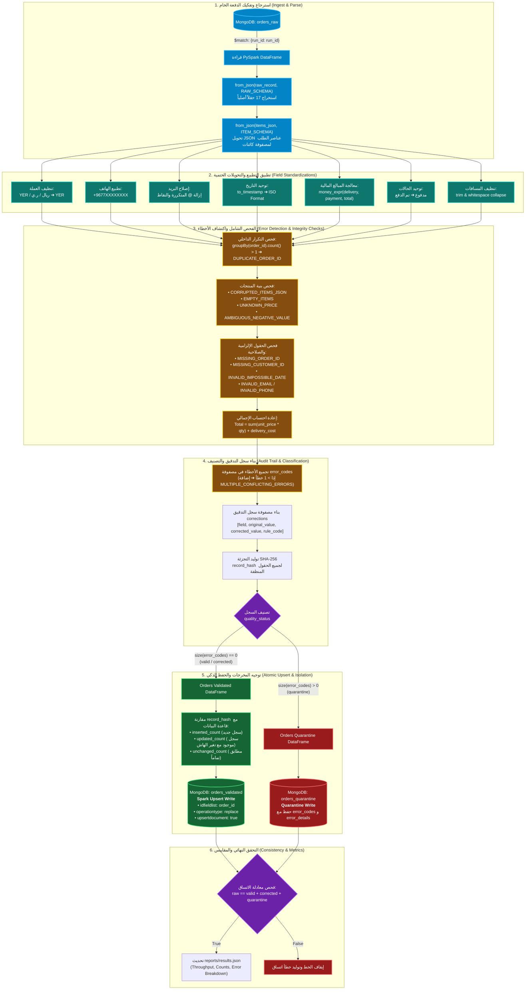
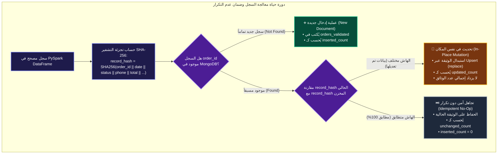
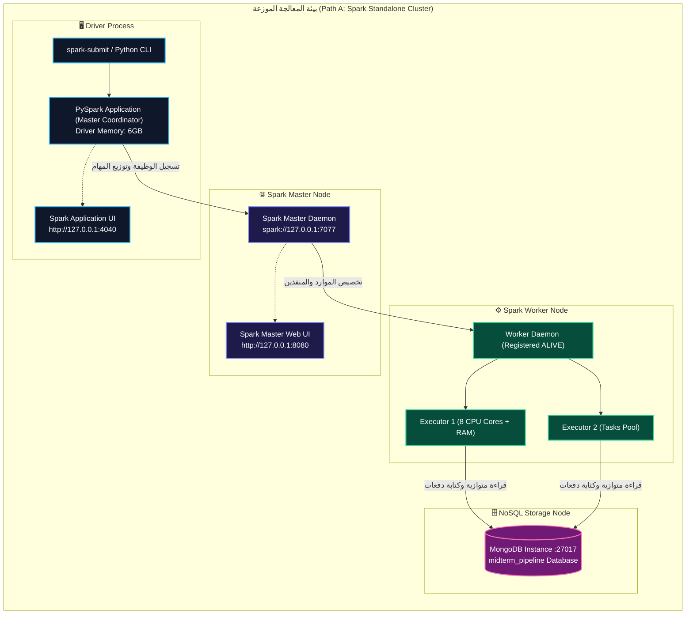
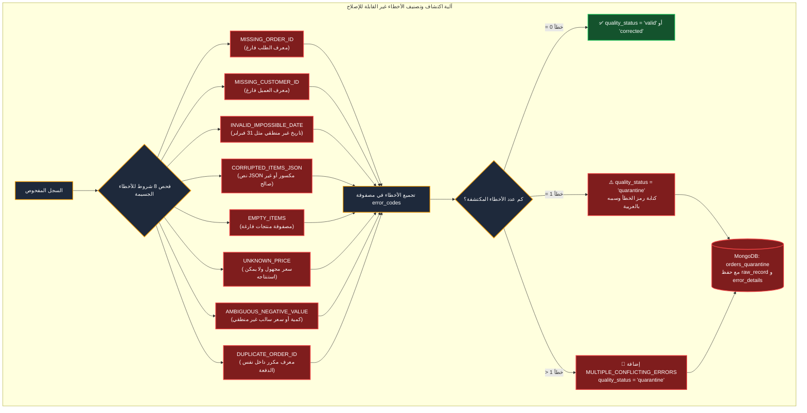
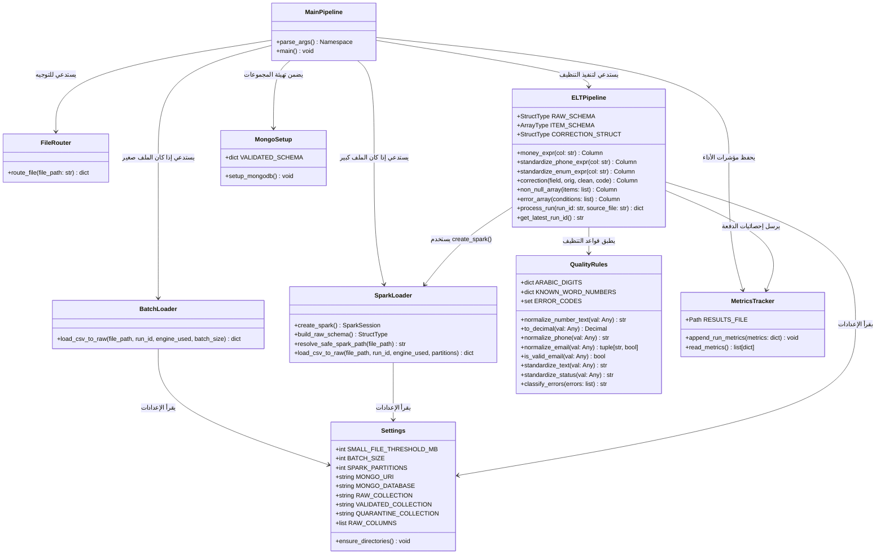
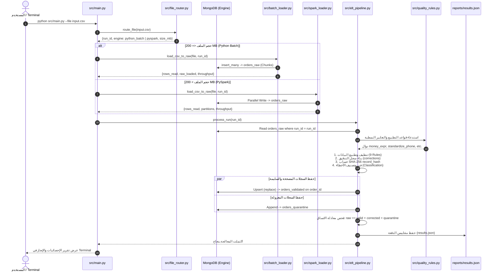
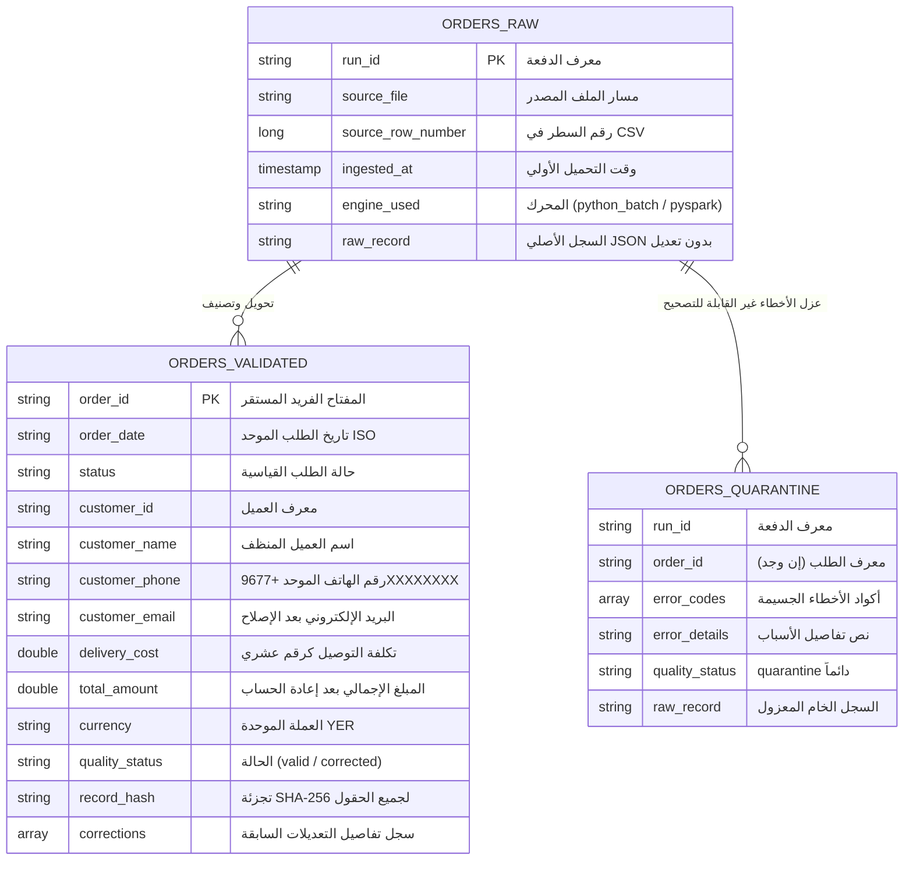

# 📊 Data Pipeline Architecture & Complete Workflow Diagrams

هذا الملف يوضح المعمارية الكاملة ومخططات تدفق ومعالجة البيانات الخاصة بمشروع **Enterprise Hybrid Data Pipeline**، مع تفصيل كامل لكافة المحركات وقواعد الجودة ومعمارية الكلاستر ودورة حياة اللاتكرارية:

---

## 1. المخطط العام لمراحل خط البيانات (End-to-End Pipeline Architecture)

```mermaid
flowchart TD
    subgraph S1 [" 1. استلام وتوجيه الملف (Ingestion & Routing) "]
        A["📄 ملف CSV خام<br/><b>(Dirty Orders Dataset)</b>"] --> B{"🔀 موجه الملفات<br/><b>src/file_router.py</b><br/>حجم الملف <= 200 MB؟"}
        B -- "نعم (حجم صغير)" --> C["⚡ تحميل تدفقي بالبايثون<br/><b>src/batch_loader.py</b><br/>• Streaming csv.DictReader<br/>• Batched insert_many"]
        B -- "لا (حجم ضخم)" --> D["🚀 معالجة متوازية بـ Spark<br/><b>src/spark_loader.py</b><br/>• Fixed Schema & Repartition<br/>• Mongo Spark Connector"]
    end

    subgraph S2 [" 2. طبقة التخزين الخام (Raw Storage Layer) "]
        C --> E[("🥉 MongoDB: orders_raw<br/><b>(حفظ كامل للسجلات الأصلية)</b><br/>• run_id & source_row_number<br/>• raw_record (Original JSON)<br/>• ingested_at & engine_used")]
        D --> E
    end

    subgraph S3 [" 3. محرك التحويل وتطبيق قواعد الجودة (ELT & Quality Rules Engine) "]
        E --> F["⚙️ محرك التحويل الموزع<br/><b>src/elt_pipeline.py</b><br/>قراءة الدفعة عبر run_id في PySpark"]
        F --> G["🧹 9 قواعد تنظيف وتطبيع حتمية<br/><b>src/quality_rules.py</b><br/>• تحويل الأرقام العربية إلى إنجليزية<br/>• توحيد العملة إلى YER وإزالة النصوص<br/>• تنظيف فواصل الآلاف والأرقام النصية<br/>• توحيد أرقام الهواتف (+9677XXXXXXXX)<br/>• إصلاح الرموز المكررة في البريد الإلكتروني<br/>• توحيد التواريخ إلى ISO Timestamp<br/>• إعادة احتساب إجمالي الطلب ومطابقته"]
    end

    subgraph S4 [" 4. فحص الجودة والتصنيف (Quality Classification & Hashing) "]
        G --> H{"🔍 هل يحتوي السجل<br/>على أخطاء غير قابلة للإصلاح؟"}
        H -- "سليم أو مصحح بأمان" --> I["✅ إنشاء سجل تدقيق (Audit Trail)<br/>• quality_status = valid / corrected<br/>• corrections [field, old, new, rule]<br/>• حساب record_hash (SHA-256)"]
        H -- "خطأ جسيم أو غير قابل للإصلاح" --> J["⚠️ تصنيف للعزل (Quarantine)<br/>• quality_status = quarantine<br/>• error_codes [MISSING_ID, CORRUPT_JSON...]<br/>• error_details"]
    end

    subgraph S5 [" 5. طبقات التخزين النهائية (Final Storage Layers) "]
        I --> K[("🥇 MongoDB: orders_validated<br/><b>(Idempotent Upsert)</b><br/>• مفتاح فريد: uq_validated_order_id<br/>• عملية Replace/Upsert على order_id<br/>• إحصاء: inserted / updated / unchanged")]
        J --> L[("🛡️ MongoDB: orders_quarantine<br/><b>(سجلات معزولة للدراسة والتحليل)</b><br/>• عزل الأخطاء دون إسقاطها")]
    end

    subgraph S6 [" 6. المراقبة والمقاييس (Observability & Metrics) "]
        K --> M["📊 حفظ مقاييس الأداء<br/><b>reports/results.json</b><br/>• الزمن، معدل التدفق (rows/s)<br/>• عدد الإدخالات والتحديثات<br/>• التحقق من معادلة الاتساق"]
        L --> M
    end

    classDef sourceStyle fill:#1e293b,stroke:#38bdf8,stroke-width:2px,color:#fff;
    classDef routerStyle fill:#0f172a,stroke:#f59e0b,stroke-width:2px,color:#fff;
    classDef processStyle fill:#047857,stroke:#10b981,stroke-width:2px,color:#fff;
    classDef rawStyle fill:#78350f,stroke:#d97706,stroke-width:2px,color:#fff;
    classDef validStyle fill:#14532d,stroke:#22c55e,stroke-width:2px,color:#fff;
    classDef quarStyle fill:#7f1d1d,stroke:#ef4444,stroke-width:2px,color:#fff;
    classDef metricsStyle fill:#312e81,stroke:#6366f1,stroke-width:2px,color:#fff;

    class A sourceStyle;
    class B routerStyle;
    class C,D,F,G processStyle;
    class E rawStyle;
    class I,K validStyle;
    class J,L quarStyle;
    class M metricsStyle;
```

---

## 2. دياجرام تفصيلي لمحرك التحويل الموزع (`src/elt_pipeline.py`)

---

## 3. دياجرام تفصيلي لقواعد الجودة والتنظيف (`src/quality_rules.py`)

```mermaid
flowchart LR
    subgraph R1 [" 1. معالجة وتطبيع المبالغ والأرقام (normalize_number_text & to_decimal) "]
        IN1["نص القيمة المدخلة"] --> TR1["تحويل الأرقام العربية المشرقية<br/>٠١٢٣٤٥٦٧٨٩ ➔ 0123456789"]
        TR1 --> CLN1["تنظيف الفواصل العشرية وفواصل الآلاف<br/>'٫' ➔ '.' وإزالة ',' و '٬'"]
        CLN1 --> REM1["إزالة نصوص العملة عبر Regex<br/>(ريال يمني | ريال | ر.ي | YER)"]
        REM1 --> WORD1{"هل القيمة نصية بكلمات؟<br/>(ألفان / خمسة آلاف / عشرة آلاف)"}
        WORD1 -- "نعم" --> MAP1["تحويل إلى القيمة الرقمية:<br/>ألفان ➔ 2000<br/>خمسة آلاف ➔ 5000<br/>عشرة آلاف ➔ 10000"]
        WORD1 -- "لا" --> DEC1["تحويل النص إلى Decimal / Double"]
        MAP1 --> DEC1
    end

    subgraph R2 [" 2. تطبيع أرقام الهواتف اليمنية (normalize_phone) "]
        IN2["رقم الهاتف المدخل"] --> STRIP2["استخراج الأرقام فقط وتجاهل الرموز"]
        STRIP2 --> PREFIX2{"فحص البادئة"}
        PREFIX2 -- "تبدأ بـ 00967 أو 967" --> PR1["استخراج الرقم الوطني (9 خانات تبدأ بـ 7)"]
        PREFIX2 -- "تبدأ بـ 07 أو 7 (9 خانات)" --> PR2["إضافة المفتاح الدولي +967"]
        PR1 --> OUT2["الصيغة القياسية: +9677XXXXXXXX"]
        PR2 --> OUT2
        PREFIX2 -- "غير ذلك (طول خاطئ / لا تبدأ بـ 7)" --> ERR_PH["إرجاع None ➔ وسم كـ INVALID_PHONE"]
    end

    subgraph R3 [" 3. إصلاح وفحص البريد الإلكتروني (normalize_email & is_valid_email) "]
        IN3["البريد الإلكتروني"] --> REP_AT["إصلاح الرموز المكررة:<br/>@+ ➔ @<br/>\\.{2,} ➔ ."]
        REP_AT --> LOW3["تحويل إلى أحرف صغيرة (lowercase)"]
        LOW3 --> CHK_EMAIL{"مطابقة Regex:<br/>^[^@\\s]+@[^@\\s]+\\.[^@\\s]+$"}
        CHK_EMAIL -- "صحيح" --> OUT3["بريد سليم + توثيق التغيير في corrections"]
        CHK_EMAIL -- "غير مطابق" --> ERR_EM["إرجاع غير صالح ➔ وسم كـ INVALID_EMAIL"]
    end

    subgraph R4 [" 4. توحيد الحالات والمرادفات (standardize_status) "]
        IN4["نص الحالة المدخلة"] --> MAP_ST{"مطابقة المرادفات"}
        MAP_ST -- "مدفوع / دفع" --> S1["تم الدفع"]
        MAP_ST -- "غير مدفوع" --> S2["بانتظار الدفع"]
        MAP_ST -- "مأكد" --> S3["مؤكد"]
        MAP_ST -- "أخرى" --> S4["الحالة المنظفة (Trimmed)"]
    end

    classDef r1Style fill:#1e3a8a,stroke:#60a5fa,stroke-width:2px,color:#fff;
    classDef r2Style fill:#14532d,stroke:#4ade80,stroke-width:2px,color:#fff;
    classDef r3Style fill:#701a75,stroke:#f472b6,stroke-width:2px,color:#fff;
    classDef r4Style fill:#7c2d12,stroke:#fb923c,stroke-width:2px,color:#fff;

    class IN1,TR1,CLN1,REM1,WORD1,MAP1,DEC1 r1Style;
    class IN2,STRIP2,PREFIX2,PR1,PR2,OUT2,ERR_PH r2Style;
    class IN3,REP_AT,LOW3,CHK_EMAIL,OUT3,ERR_EM r3Style;
    class IN4,MAP_ST,S1,S2,S3,S4 r4Style;
```

---

## 4. مخطط دورة حياة ومراحل اللاتكرارية والتحديث (Idempotency & SHA-256 State Machine)

---

## 5. معمارية الكلاستر والمسار الموزع (Path A: Spark Standalone Architecture)

---

## 6. شجرة قرارات تصنيف وعزل الأخطاء (Quarantine Decision Tree & Error Hierarchy)

---

## 7. مخطط الكلاسات والموديولات الشامل (Class & Module Diagram)

---

## 8. مخطط تسلسل تنفيذ خط البيانات (Pipeline Sequence Diagram)

---

## 9. مخطط بنية المجموعات وقواعد التحقق (MongoDB Collections & Data Model)

