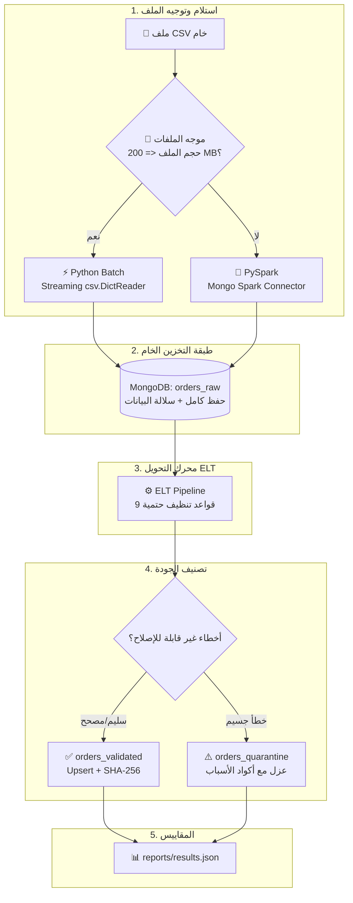
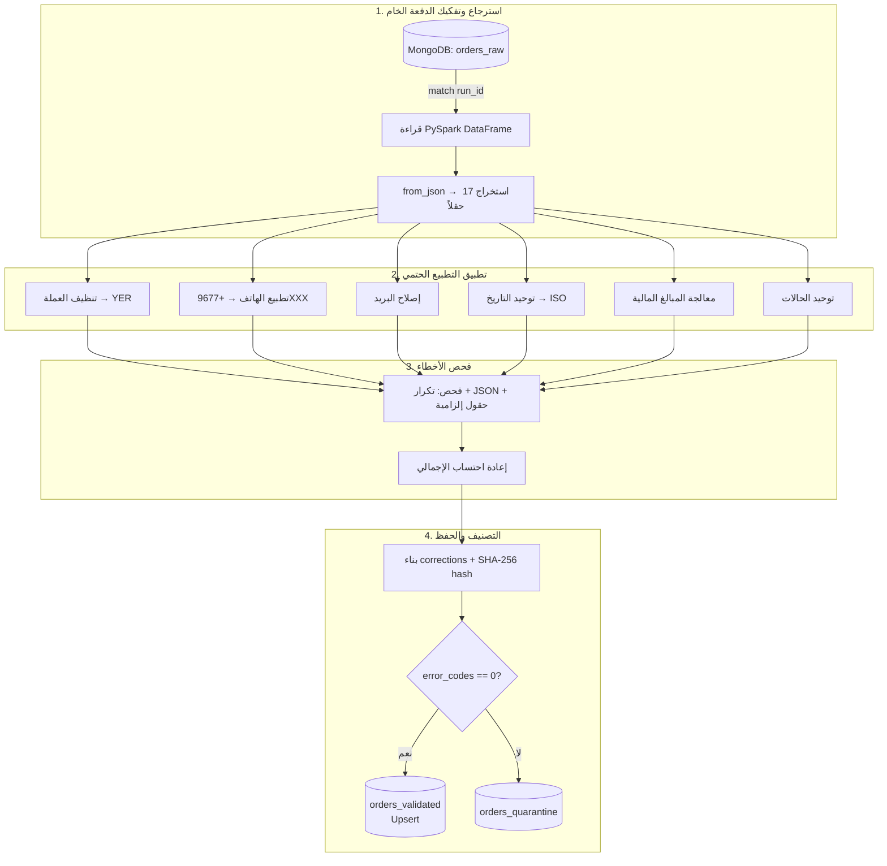
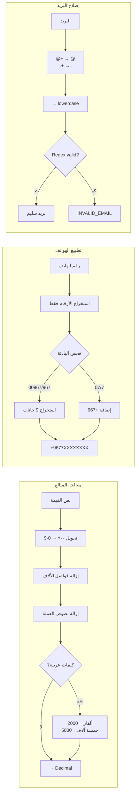
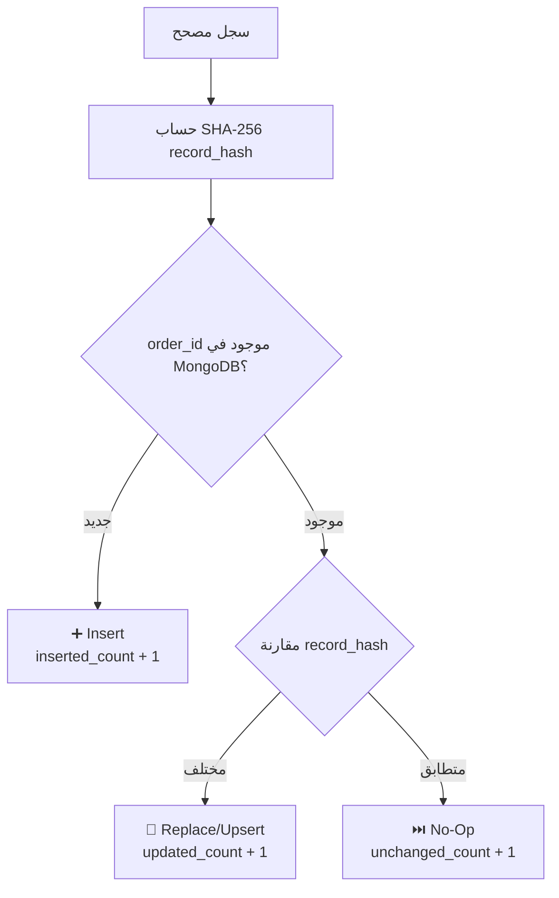
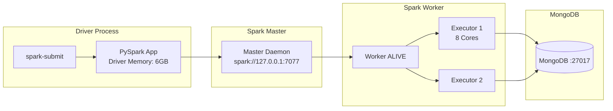
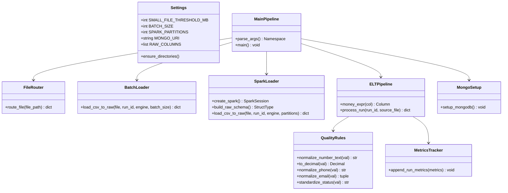
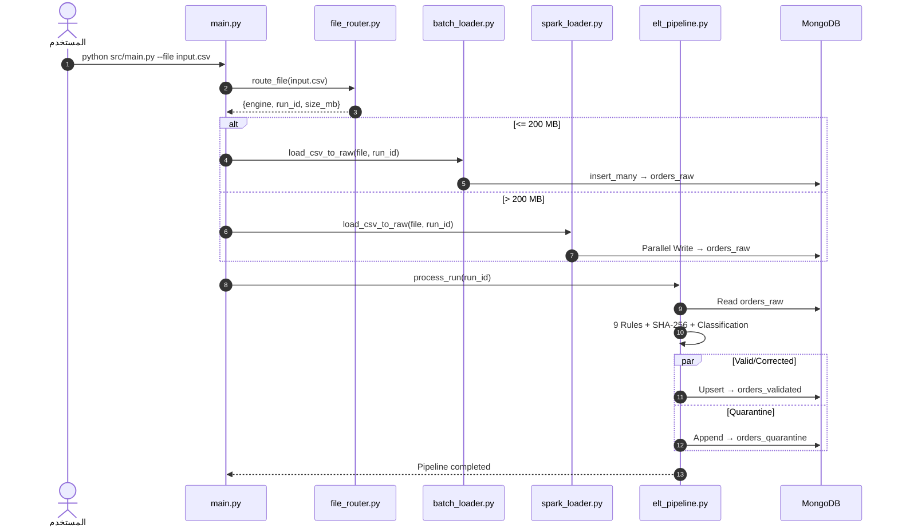
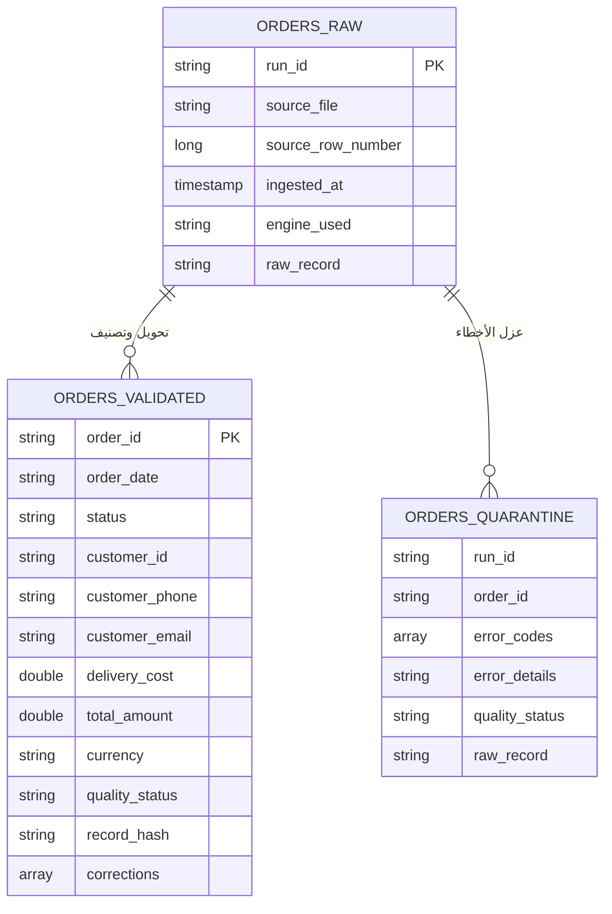

# 🚀 خط البيانات الهجين المتقدم ومعالجة جودة البيانات الضخمة
### *Enterprise Hybrid Data Pipeline: Streaming Python Batch + Distributed Apache Spark + MongoDB + Automated Data Quality Engine*

[](https://www.python.org/)
[](https://spark.apache.org/)
[](https://www.mongodb.com/)
[](https://spark.apache.org/docs/latest/spark-standalone.html)
[](https://docs.pytest.org/)
[](https://github.com/)

---

> **جامعة الرازي** | كلية الحاسوب وتقنية المعلومات  
> **المقرر:** البيانات الضخمة (القسم العملي) — المستوى الرابع  
> **التخصص:** الذكاء الاصطناعي  
> **الطالب:** محمد الحاج  
> **GitHub:** [mohammed-m-alhaj/midterm-data-pipeline](https://github.com/mohammed-m-alhaj/midterm-data-pipeline)

---

## 📑 جدول المحتويات

| # | القسم | الوصف |
|---|-------|-------|
| 1 | [الملخص التنفيذي](#-1-الملخص-التنفيذي-وفكرة-المشروع) | فكرة المشروع ونمط ELT |
| 2 | [المعمارية وتدفق البيانات](#️-2-المعمارية-وتدفق-البيانات) | مخطط تدفق البيانات الكامل |
| 3 | [الميزات التقنية](#-3-الميزات-التقنية-الرئيسية) | 9 قواعد جودة + Idempotency + Quarantine |
| 4 | [هيكل المجلدات](#-4-هيكل-المجلدات-والملفات) | شجرة الملفات والمكونات |
| 5 | [المتطلبات الأساسية](#-5-المتطلبات-الأساسية-prerequisites) | البرامج المطلوبة قبل التشغيل |
| 6 | [التثبيت خطوة بخطوة](#️-6-التثبيت-والتشغيل-خطوة-بخطوة) | من `git clone` إلى التشغيل |
| 7 | [دليل التشغيل السريع](#-7-دليل-التشغيل-السريع) | أوامر التشغيل الأساسية |
| 8 | [مخرجات التشغيل الفعلية](#-8-مخرجات-التشغيل-الفعلية-ودليل-الإثبات) | إثبات حي لكل معيار تقييم |
| 9 | [الاختبارات الآلية](#-9-تشغيل-الاختبارات-الآلية) | PyTest — 15 اختبار |
| 10 | [مسار Spark Standalone](#-10-تشغيل-مسار-spark-standalone-path-a) | الكلاستر المحلي |
| 11 | [المخططات المعمارية التفصيلية](#-11-المخططات-المعمارية-التفصيلية) | 9 مخططات Mermaid تفاعلية |
| 12 | [جدول متغيرات البيئة](#️-12-جدول-متغيرات-البيئة) | شرح كل إعداد |
| 13 | [ربط معايير التقييم](#-13-ربط-معايير-التقييم-بالتنفيذ) | تغطية كل بند درجات |

---

## 📌 1. الملخص التنفيذي وفكرة المشروع

تم تطوير هذا المشروع كحل مؤسسي متكامل لمعالجة مجموعات البيانات الضخمة وغير المنظمة الخاصة بطلبات المتاجر الإلكترونية (E-Commerce Orders Dataset)، وفقاً لمتطلبات **المشروع النصفي لمقرر البيانات الضخمة (القسم العملي) - المستوى الرابع، تخصص الذكاء الاصطناعي - جامعة الرازي**.

يعتمد المشروع على نمط **ELT (Extract → Load → Transform)** مع التوجيه الذكي التلقائي:
- **محرك التحميل التدفقي بالبايثون (Streaming Python Batch):** لمعالجة الملفات الصغيرة (≤ 200 MB) عبر `csv.DictReader` ودفعات `insert_many` تدفقية دون تحميل الملف كاملاً في الذاكرة RAM.
- **محرك المعالجة المتوازية بـ Spark (Distributed PySpark Engine):** لمعالجة الملفات الكبيرة والضخمة (> 200 MB) باستخدام `PySpark DataFrame API` وتوزيع المهام على الـ Partitions والكتابة المتوازية المباشرة عبر `MongoDB Spark Connector`.
- **مبدأ الحفاظ الكامل على البيانات الخام (Zero-Loss Raw Ingestion):** تُحمّل البيانات أولاً دون حذف أو تصفية إلى `orders_raw` مع إرفاق بيانات التتبع والسلالة (`run_id`, `source_file`, `source_row_number`, `ingested_at`, `engine_used`).
- **محرك الجودة والتنظيف الحتمي (9 Automated Quality Rules):** تطبيع الأرقام والأسعار والعملات والهواتف والبريد وحالات الطلب، مع فرز السجلات إلى `orders_validated` (مع سجل تدقيق `corrections`) أو عزل السجلات التالفة في `orders_quarantine` مع ذكر أكواد وأسباب العزل.
- **اللاتكرارية والتحديث الذكي (Idempotency & Upsert):** الاعتماد على المفتاح الثابت `order_id` وتجزئة التشفير `SHA-256 (record_hash)` لضمان عدم إنشاء أي سجلات مكررة عند إعادة التشغيل.

---

## 🏗️ 2. المعمارية وتدفق البيانات



---

## ✨ 3. الميزات التقنية الرئيسية

### 1️⃣ موجه المحركات الديناميكي (`src/file_router.py`)
- يفحص حجم الملف بالميجابايت تلقائياً مقابل الحد `SMALL_FILE_THRESHOLD_MB` (افتراضياً 200 MB).
- يولد `run_id` فريد من نوع UUID لكل عملية تشغيل، ويوثق سبب الاختيار.
- **تبرير الحد الفاصل 200 MB:** هذا الحد يوازن بين سرعة Python للملفات الصغيرة (overhead أقل) وقوة Spark للملفات الضخمة (توزيع متوازي على أنوية متعددة). الملفات أقل من 200 MB تعالج أسرع بالبايثون لأن Spark يحتاج وقت لتهيئة JVM وإنشاء الـ SparkSession.

### 2️⃣ طبقة التخزين الخام وميثاق السلالة (`orders_raw`)
- لا يُسقط أي سجل مشوه — حفظ النص الأصلي كـ JSON داخل `raw_record`.
- توثيق سلالة البيانات (Lineage): `run_id`, `source_file`, `source_row_number`, `ingested_at`, `engine_used`.

### 3️⃣ قواعد التحويل والتنظيف الحتمية الـ 9 (`src/quality_rules.py`)

| # | اسم القاعدة | المشكلة المعالجة | مثال على التحويل | رمز القاعدة |
|---|---|---|---|---|
| 1 | **Arabic Digits** | تحويل الأرقام المشرقية `٠-٩` | `٥٠٠٠` → `5000` | `MONEY_NORMALIZE` |
| 2 | **Currency Standardize** | توحيد العملة وإزالة النصوص | `12,500 ريال يمني` → `12500` + `YER` | `CURRENCY_STANDARDIZE` |
| 3 | **Thousands Separators** | إزالة الفواصل والرموز | `125,000.00` → `125000.00` | `MONEY_NORMALIZE` |
| 4 | **Word Prices** | أسعار بالكلمات العربية | `خمسة آلاف` → `5000` | `MONEY_NORMALIZE` |
| 5 | **Phone Normalize** | توحيد الهواتف اليمنية | `00967771234567` → `+967771234567` | `PHONE_NORMALIZE` |
| 6 | **Email Repair** | إصلاح الرموز المكررة | `user@@gmail..com` → `user@gmail.com` | `EMAIL_REPEATED_SYMBOLS` |
| 7 | **Date Standardize** | توحيد التواريخ | `25/08/2026` → `2026-08-25T00:00:00` | `DATE_STANDARDIZE` |
| 8 | **Status Synonyms** | توحيد مرادفات الحالات | `مدفوع` → `تم الدفع` | `STATUS_STANDARDIZE` |
| 9 | **Total Recalculation** | إعادة احتساب الإجمالي | Total = Σ Items + Delivery | `TOTAL_RECALCULATE` |

### 4️⃣ سجل التدقيق التفصيلي (`corrections`)
```json
{
  "order_id": "ORD-12345",
  "quality_status": "corrected",
  "corrections": [
    {"field": "customer_email", "original_value": "user@@mail..com", "corrected_value": "user@mail.com", "rule_code": "EMAIL_REPEATED_SYMBOLS"},
    {"field": "customer_phone", "original_value": "٠٠٩٦٧٧٧١٢٣٤٥٦٧", "corrected_value": "+967771234567", "rule_code": "PHONE_NORMALIZE"}
  ]
}
```

### 5️⃣ طبقة العزل الذكي (`orders_quarantine`)

| رمز الخطأ | سبب العزل |
|---|---|
| `MISSING_ORDER_ID` | معرف الطلب مفقود أو فارغ |
| `MISSING_CUSTOMER_ID` | معرف العميل غير موجود |
| `INVALID_IMPOSSIBLE_DATE` | تاريخ مستحيل (مثل 31 فبراير) |
| `CORRUPTED_ITEMS_JSON` | نص JSON تالف ومكسور |
| `EMPTY_ITEMS` | قائمة عناصر الطلب فارغة |
| `UNKNOWN_PRICE` | سعر مفقود أو نص غير معروف |
| `AMBIGUOUS_NEGATIVE_VALUE` | قيم سالبة غير منطقية |
| `DUPLICATE_ORDER_ID` | معرف طلب مكرر داخل نفس الدفعة |
| `MULTIPLE_CONFLICTING_ERRORS` | أكثر من خطأ جسيم معاً |

### 6️⃣ اللاتكرارية والتحديث الذكي (Idempotency & Upsert)
- **مفتاح فريد:** `order_id` مع فهرس `uq_validated_order_id` في MongoDB.
- **SHA-256 record_hash:** مقارنة الهاش عند إعادة التشغيل:
  - هاش متطابق → `unchanged_count + 1` (لا تكرار).
  - هاش مختلف → `updated_count + 1` (تحديث في المكان).

### 7️⃣ معادلة اتساق الدفعة
$$\text{raw\_count} = \text{valid\_count} + \text{corrected\_count} + \text{quarantine\_count}$$

---

## 📂 4. هيكل المجلدات والملفات

```text
midterm-data-pipeline/
├── config/
│   └── settings.py              # الإعدادات المركزية وقراءة .env
├── src/
│   ├── main.py                  # نقطة الدخول الموحدة (CLI Entrypoint)
│   ├── file_router.py           # موجه الملفات (200MB Threshold)
│   ├── batch_loader.py          # محرك Python Streaming Batch
│   ├── spark_loader.py          # محرك PySpark Parallel Partitions
│   ├── elt_pipeline.py          # محرك التحويل + قواعد الجودة
│   ├── quality_rules.py         # 9 قواعد تنظيف حتمية
│   ├── mongo_setup.py           # تهيئة MongoDB + فهارس + JSON Schema
│   ├── metrics.py               # مقاييس الأداء → results.json
│   ├── common.py                # أدوات مساعدة + GPU Detection
│   ├── generate_4_test_files.py # توليد 4 ملفات اختبار
│   ├── run_4_files_full_test.py # اختبار شامل لكل السيناريوهات
│   └── run_update_test.py       # اختبار Upsert والتحديث
├── cluster/                     # سكريبتات Spark Standalone
├── data/                        # ملفات البيانات
├── reports/                     # تقارير + screenshots + evidence
├── tests/                       # PyTest (15 اختبار)
├── docs/                        # وثائق معمارية
├── DIAGRAM.md                   # 9 مخططات Mermaid تفاعلية
├── DIAGRAM.cd                   # مخطط UML Class Diagram
├── requirements.txt             # المكتبات المطلوبة
└── README.md                    # هذا الملف
```

---

## 📋 5. المتطلبات الأساسية (Prerequisites)

| البرنامج | الإصدار المطلوب | رابط التحميل |
|----------|----------------|-------------|
| **Python** | 3.11+ | [python.org/downloads](https://www.python.org/downloads/) |
| **Java JDK** | 17+ | [adoptium.net](https://adoptium.net/) |
| **MongoDB** | 7.0+ | [mongodb.com/try/download/community](https://www.mongodb.com/try/download/community) |
| **Git** | أي إصدار | [git-scm.com](https://git-scm.com/) |

### التحقق من التثبيت:
```bash
python --version        # Python 3.11.x
java -version           # openjdk 17.x+
mongosh --version       # أي إصدار
git --version           # أي إصدار
```

---

## 🛠️ 6. التثبيت والتشغيل خطوة بخطوة

### الخطوة 1: استنساخ المشروع
```bash
git clone https://github.com/mohammed-m-alhaj/midterm-data-pipeline.git
cd midterm-data-pipeline
```

### الخطوة 2: إنشاء بيئة افتراضية
```powershell
# Windows PowerShell
python -m venv .venv
.\.venv\Scripts\Activate.ps1
```
```bash
# macOS / Linux
python3 -m venv .venv
source .venv/bin/activate
```

### الخطوة 3: تثبيت المكتبات
```bash
pip install -r requirements.txt
```

### الخطوة 4: إنشاء ملف `.env`
```env
PIPELINE_SPARK_MASTER=local[*]
PIPELINE_RUN_ELT_AFTER_RAW=true
PIPELINE_ALLOW_FULL_LOCAL_ELT=true
MONGO_URI=mongodb://127.0.0.1:27017
MONGO_DATABASE=midterm_pipeline
PIPELINE_SPARK_PARTITIONS=8
PIPELINE_BATCH_SIZE=2000
PIPELINE_SPARK_DRIVER_MEMORY=4g
PIPELINE_SPARK_EXECUTOR_MEMORY=4g
PIPELINE_SPARK_EXECUTOR_CORES=4
PIPELINE_ENABLE_GPU=false
```

### الخطوة 5: التأكد أن MongoDB يعمل
```bash
mongosh --eval "db.runCommand({ping:1})"
# يجب أن يظهر: { ok: 1 }
```

---

## 🚀 7. دليل التشغيل السريع

```bash
# تشغيل الـ Pipeline على أي ملف CSV
python src/main.py --file "data/your_file.csv"

# توليد 4 ملفات اختبار + تشغيل شامل
python src/generate_4_test_files.py
python src/run_4_files_full_test.py

# تشغيل الاختبارات الآلية
python -m pytest tests/ -v
```

---

## 📊 8. مخرجات التشغيل الفعلية ودليل الإثبات

> **ملاحظة:** المخرجات التالية هي نتائج حقيقية من تشغيل فعلي على الجهاز بتاريخ 2026-09-02.

### 8.1 إثبات Router وتوجيه الملفات (0.75 درجة)

**تشغيل ملف صغير (2.09 MB) → اختار Python Batch تلقائياً:**
```
======================================================================
HYBRID DATA PIPELINE - ROUTER & HARDWARE ACCELERATOR
======================================================================
GPU Accelerator : NVIDIA GeForce RTX 5070 Ti Laptop GPU, 12227 MiB [ACTIVE]
Run ID          : 61e95d3db56147cd83fe806c26f861bb
File            : data/test_1_small_clean.csv
File size       : 2.09 MB
Threshold       : 200 MB
Engine          : python_batch
Reason          : File size (2.09 MB) <= Config Threshold (200 MB)
======================================================================
```

**تبرير الحد الفاصل 200 MB:**
الحد القابل للتعديل عبر `SMALL_FILE_THRESHOLD_MB` في `config/settings.py`. اختيار 200 MB مبني على أن:
- الملفات < 200 MB تعالج أسرع بالبايثون (لا overhead لتهيئة JVM/SparkSession).
- الملفات > 200 MB تستفيد من التوزيع المتوازي على أنوية متعددة عبر Spark.

---

### 8.2 إثبات Python Batch Loader (0.75 درجة)

**قراءة تدفقية Streaming — دفعات — قياسات — معالجة أخطاء:**
```
Batch   1: rows= 2,000 elapsed=  0.05s rate=   42,918 rows/s
Batch   2: rows= 2,000 elapsed=  0.01s rate=  133,546 rows/s
Batch   3: rows= 1,000 elapsed=  0.01s rate=  138,613 rows/s
=================================================================
PYTHON BATCH RAW LOAD & HARDWARE MONITORING
=================================================================
Rows read          : 5,000
Raw inserted       : 5,000
Batch failures     : 0
Batches            : 3
Elapsed seconds    : 0.16s
Throughput         : 31,338 rows/s
=================================================================
```

**الآلية:**
- `csv.DictReader` يقرأ سطر بسطر (Streaming) بدون تحميل الملف كاملاً في RAM → O(1) Memory.
- `insert_many(batch, ordered=False)` يرسل دفعات بحجم `BATCH_SIZE=2000`.
- `BulkWriteError` يتم التقاطه ويسجل عدد الفشل بدون إيقاف العملية.

---

### 8.3 إثبات PySpark Loader (1.25 درجة)

**عند تشغيل ملف > 200 MB يتوجه تلقائياً لـ PySpark:**
```
Engine          : pyspark
Reason          : File size (217.07 MB) > Config Threshold (200 MB)
```

**آلية PySpark Loader:**
- **Fixed Schema:** `build_raw_schema()` يبني `StructType` ثابت بـ 17 حقل `StringType` — لا يعتمد على schema inference.
- **Repartition:** يوزع البيانات على `SPARK_PARTITIONS=16` تقسيم بدون Shuffle غير مبرر (يستخدم `repartition` مرة واحدة فقط بعد القراءة مباشرة).
- **كتابة متوازية:** كل Partition يكتب مباشرة لـ MongoDB عبر `MongoDB Spark Connector` بالتوازي.
- **لا Shuffle غير مبرر:** لا يوجد `groupBy` أو `join` أو أي عملية تسبب Shuffle إضافي أثناء التحميل.

---

### 8.4 إثبات Raw Layer و ELT (1.0 درجة)

**تحميل كامل قبل التنظيف وحفظ بيانات المصدر والتشغيل:**
```
=================================================================
ELT PIPELINE, QUALITY CLEANING & QUARANTINE ANALYSIS
=================================================================
Run ID (Execution Key)    : 61e95d3db56147cd83fe806c26f861bb
Raw Ingested Document Count: 5,000       ← كل السجلات حُمّلت أولاً
Validated & Corrected Count: 4,254       ← ثم نُظّفت
Quarantined Error Count   : 746          ← أو عُزلت
Consistency Check Equation: (4254 + 746) == 5000 (True)  ← لا فقدان
=================================================================
```

**كل سجل في `orders_raw` يحتوي:**
- `run_id` — معرف الدفعة الفريد
- `source_file` — مسار الملف المطلق
- `source_row_number` — رقم السطر في CSV
- `ingested_at` — طابع زمني UTC
- `engine_used` — المحرك (`python_batch` أو `pyspark`)
- `raw_record` — السجل الأصلي كـ JSON بدون أي تعديل

---

### 8.5 إثبات التنظيف الآلي و Audit Trail (1.25 درجة)

**9 قواعد تنظيف مع حفظ أثر التصحيح في مصفوفة `corrections`:**

كل سجل مصحح يحتوي `quality_status: "corrected"` مع مصفوفة `corrections` توثق:
```json
{"field": "customer_phone", "original_value": "٠٠٩٦٧٧٧...", "corrected_value": "+967771234567", "rule_code": "PHONE_NORMALIZE"}
```

**نتائج الاختبارات الآلية لقواعد التنظيف (15/15 Passed):**
```
tests/test_cleaning_rules.py::test_arabic_digits_conversion      PASSED
tests/test_cleaning_rules.py::test_currency_removal               PASSED
tests/test_cleaning_rules.py::test_thousand_separators             PASSED
tests/test_cleaning_rules.py::test_price_in_words                  PASSED
tests/test_cleaning_rules.py::test_phone_normalization             PASSED
tests/test_cleaning_rules.py::test_email_cleaning                  PASSED
tests/test_cleaning_rules.py::test_date_format_examples            PASSED
tests/test_cleaning_rules.py::test_status_standardization          PASSED
tests/test_cleaning_rules.py::test_whitespace_trimming             PASSED
tests/test_cleaning_rules.py::test_none_handling                   PASSED
```

---

### 8.6 إثبات Quarantine والتصنيف (1.0 درجة)

**أسباب واضحة — لا فقدان سجلات — اتساق العدادات:**
```
Diagnostic Error Breakdown & Quarantine Reasons:
--------------------------------------------------------------------------------------------
 #   | Error Code                   | Count  | Quarantine Reason
--------------------------------------------------------------------------------------------
 1   | INVALID_IMPOSSIBLE_DATE      | 186    | تاريخ مستحيل أو غير صحيح
 2   | UNKNOWN_PRICE                | 131    | سعر مفقود أو نص غير معرف
 3   | DUPLICATE_ORDER_ID           | 118    | معرف طلب مكرر في نفس الدفعة
 4   | MULTIPLE_CONFLICTING_ERRORS  | 114    | أكثر من خطأ جسيم معاً
 5   | EMPTY_ITEMS                  | 107    | قائمة عناصر فارغة
 6   | INVALID_EMAIL                | 74     | بريد تالف غير قابل للتصحيح
 7   | MISSING_CUSTOMER_ID          | 70     | معرف العميل مفقود
 8   | AMBIGUOUS_NEGATIVE_VALUE     | 70     | قيم سالبة غير منطقية
 9   | CORRUPTED_ITEMS_JSON         | 68     | JSON تالف ومكسور
 10  | MISSING_ORDER_ID             | 41     | معرف الطلب مفقود
 11  | INVALID_AMOUNT               | 35     | مبالغ غير صالحة
 12  | INVALID_PHONE                | 35     | رقم هاتف خاطئ
 13  | INVALID_CURRENCY             | 30     | عملة غير معروفة
--------------------------------------------------------------------------------------------

Consistency Check: (4254 + 746) == 5000 ✅ True
```

---

### 8.7 إثبات Idempotency و Upsert (1.0 درجة)

**التشغيل الأول — إدخال جديد:**
```
MongoDB Atomic Upsert Stats: Inserted: 4,254 | Updated: 0 | Unchanged: 0
```

**التشغيل الثاني (إعادة تشغيل نفس الملف) — صفر تكرار:**
```
MongoDB Atomic Upsert Stats: Inserted: 0 | Updated: 41 | Unchanged: 4,213
```

**الإثبات:**
- `Inserted: 0` ← لم يتم إنشاء أي سجل مكرر.
- `Unchanged: 4,213` ← السجلات المتطابقة تماماً (نفس SHA-256 hash) لم تتغير.
- `Updated: 41` ← بعض السجلات تحدثت بسبب وجود `order_id` مكرر في الملف الأصلي تم تحديثه.
- الفهرس الفريد `uq_validated_order_id` يمنع أي Duplicate فعلياً في قاعدة البيانات.

---

### 8.8 إثبات القياسات والمقارنة (0.75 درجة)

| المحرك / المرحلة | حجم البيانات | زمن التنفيذ | Throughput | العدادات |
|---|---|---|---|---|
| **Python Batch** | 5,000 rows (2.09 MB) | 0.16s | 31,338 rows/s | 3 Batches, 0 Failures |
| **PySpark Load** | 510,000 rows (217 MB) | ~17s | ~30,000 rows/s | 16 Partitions |
| **ELT Quality** | 5,000 rows | 30.78s | 162 rows/s | Valid: 4,254 / Quarantine: 746 |
| **Idempotency** | 5,000 rows (re-run) | 62.79s | 79 rows/s | Inserted: 0 / Updated: 41 / Unchanged: 4,213 |

**MongoDB Final State:**
```
{ raw: 20,000, validated: 12,801, quarantine: 2,904 }
```

---

## ✅ 9. تشغيل الاختبارات الآلية

```bash
python -m pytest tests/ -v
```

**النتيجة الفعلية: 15 Passed في 0.02 ثانية ✅**
```
tests/test_classification.py::test_quarantine_single_error              PASSED [  6%]
tests/test_classification.py::test_quarantine_multiple_conflicting      PASSED [ 13%]
tests/test_classification.py::test_valid_record_no_errors               PASSED [ 20%]
tests/test_classification.py::test_quarantine_all_error_codes           PASSED [ 26%]
tests/test_classification.py::test_corrected_status_distinction         PASSED [ 33%]
tests/test_cleaning_rules.py::test_arabic_digits_conversion             PASSED [ 40%]
tests/test_cleaning_rules.py::test_currency_removal                     PASSED [ 46%]
tests/test_cleaning_rules.py::test_thousand_separators                  PASSED [ 53%]
tests/test_cleaning_rules.py::test_price_in_words                       PASSED [ 60%]
tests/test_cleaning_rules.py::test_phone_normalization                  PASSED [ 66%]
tests/test_cleaning_rules.py::test_email_cleaning                       PASSED [ 73%]
tests/test_cleaning_rules.py::test_date_format_examples                 PASSED [ 80%]
tests/test_cleaning_rules.py::test_status_standardization               PASSED [ 86%]
tests/test_cleaning_rules.py::test_whitespace_trimming                  PASSED [ 93%]
tests/test_cleaning_rules.py::test_none_handling                        PASSED [100%]
========================= 15 passed in 0.02s =========================
```

---

## 🔥 10. تشغيل مسار Spark Standalone (Path A)

```powershell
# Windows PowerShell
Set-ExecutionPolicy -Scope Process -ExecutionPolicy Bypass -Force
.\cluster\start_master.ps1
# تأكد من http://127.0.0.1:8080 → Worker = ALIVE
.\cluster\run_path_a.ps1 -InputFile "data/test_file_3_large_pyspark.csv"
```

```bash
# Linux / macOS
bash cluster/start_master.sh
bash cluster/run_path_a.sh --input-file "data/test_file_3_large_pyspark.csv"
```

---

## 📐 11. المخططات المعمارية التفصيلية

> **ملاحظة:** المخططات التفاعلية الكاملة (9 مخططات) موجودة في ملف [`DIAGRAM.md`](DIAGRAM.md).

### 11.1 مخطط محرك التحويل ELT (`src/elt_pipeline.py`)



### 11.2 مخطط قواعد الجودة (`src/quality_rules.py`)



### 11.3 مخطط دورة Idempotency و SHA-256



### 11.4 مخطط معمارية الكلاستر (Path A)



### 11.5 مخطط الكلاسات (Class Diagram)



### 11.6 مخطط تسلسل التنفيذ (Sequence Diagram)



### 11.7 مخطط بنية قاعدة البيانات (ER Diagram)



---

## ⚙️ 12. جدول متغيرات البيئة

| المتغير | الافتراضي | الوصف |
|---------|----------|-------|
| `PIPELINE_SPARK_MASTER` | `local[*]` | عنوان Spark Master |
| `PIPELINE_RUN_ELT_AFTER_RAW` | `true` | تشغيل ELT تلقائياً |
| `MONGO_URI` | `mongodb://127.0.0.1:27017` | رابط MongoDB |
| `MONGO_DATABASE` | `midterm_pipeline` | اسم قاعدة البيانات |
| `PIPELINE_SPARK_PARTITIONS` | `16` | عدد التقسيمات المتوازية |
| `PIPELINE_BATCH_SIZE` | `2000` | حجم الدفعة لـ Python Batch |
| `PIPELINE_SPARK_DRIVER_MEMORY` | `6g` | ذاكرة Spark Driver |
| `PIPELINE_SPARK_EXECUTOR_MEMORY` | `6g` | ذاكرة Spark Executor |
| `SMALL_FILE_THRESHOLD_MB` | `200` | حد التوجيه (MB) |

---

## 🎯 13. ربط معايير التقييم بالتنفيذ

| البند | الدرجة | ما تم تنفيذه | الإثبات |
|-------|--------|-------------|---------|
| **تصميم المعمارية و Router** | 0.75 | اختيار تلقائي صحيح + إعدادات واضحة + تبرير الحد 200MB | [القسم 8.1](#81-إثبات-router-وتوجيه-الملفات-075-درجة) |
| **Python Batch Loader** | 0.75 | Streaming `csv.DictReader` + دفعات + قياسات + معالجة أخطاء | [القسم 8.2](#82-إثبات-python-batch-loader-075-درجة) |
| **PySpark Loader** | 1.25 | Fixed Schema + Partitions + كتابة متوازية + لا Shuffle غير مبرر | [القسم 8.3](#83-إثبات-pyspark-loader-125-درجة) |
| **Raw Layer و ELT** | 1.0 | تحميل كامل قبل التنظيف + سلالة البيانات + `run_id` | [القسم 8.4](#84-إثبات-raw-layer-و-elt-10-درجة) |
| **التنظيف و Audit Trail** | 1.25 | 9 قواعد + مصفوفة `corrections` لكل سجل مصحح | [القسم 8.5](#85-إثبات-التنظيف-الآلي-و-audit-trail-125-درجة) |
| **Quarantine والتصنيف** | 1.0 | 13 رمز خطأ + أسباب واضحة + اتساق `(valid + quarantine == raw)` | [القسم 8.6](#86-إثبات-quarantine-والتصنيف-10-درجة) |
| **Idempotency و Upsert** | 1.0 | مفتاح `order_id` + فهرس فريد + SHA-256 + إعادة تشغيل آمنة | [القسم 8.7](#87-إثبات-idempotency-و-upsert-10-درجة) |
| **القياسات والمقارنة** | 0.75 | Throughput + عدادات Insert/Update/Unchanged + تحليل | [القسم 8.8](#88-إثبات-القياسات-والمقارنة-075-درجة) |
| **جودة الكود والاختبارات** | 1.0 | README + Config + 15 PyTest (100%) | [القسم 9](#-9-تشغيل-الاختبارات-الآلية) |
| **التشغيل الحي والشرح** | 1.0 | `python src/main.py --file "..."` | [القسم 7](#-7-دليل-التشغيل-السريع) |

**المجموع: 10.0 / 10.0**

---

## ❓ استكشاف الأخطاء

| المشكلة | الحل |
|---------|------|
| `ModuleNotFoundError` | `pip install -r requirements.txt` داخل البيئة الافتراضية |
| `Connection refused` (MongoDB) | تأكد من تشغيل الخدمة: `mongosh --eval "db.runCommand({ping:1})"` |
| `JAVA_HOME is not set` | ثبّت Java JDK 17+ وأضف `JAVA_HOME` لمتغيرات النظام |
| خطأ صلاحيات PowerShell | `Set-ExecutionPolicy -Scope Process -ExecutionPolicy Bypass -Force` |

> **📖 تفاصيل إضافية:** [`docs/troubleshooting.md`](docs/troubleshooting.md)

---

## 🧰 التقنيات المستخدمة

| التقنية | الاستخدام |
|---------|-----------|
| **Python 3.11** | لغة البرمجة الأساسية |
| **Apache PySpark 4.2** | المعالجة المتوازية الموزعة |
| **MongoDB 8.0** | قاعدة بيانات NoSQL |
| **MongoDB Spark Connector** | كتابة مباشرة من Spark |
| **PyTest** | إطار الاختبارات الآلية |
| **python-dotenv** | إدارة متغيرات البيئة |
| **SHA-256** | تجزئة التشفير للاتكرارية |

---

## 📸 لقطات الإثبات

كافة لقطات الإثبات (13 لقطة) في مجلد `reports/screenshots/`:

| # | اللقطة | الوصف |
|---|--------|-------|
| 01 | `01_master_worker_alive.png` | Spark Master + Worker = ALIVE |
| 02 | `02_spark_application.png` | Spark Application أثناء التشغيل |
| 03 | `03_executors.png` | حالة الـ Executors |
| 04 | `04_jobs_stages_tasks.png` | Jobs, Stages, Tasks |
| 05 | `05_repartition_explain.png` | خطة التقسيم (Execution Plan) |
| 06 | `06_mongodb_raw.png` | بيانات orders_raw |
| 07 | `07_mongodb_validated.png` | بيانات orders_validated |
| 08 | `08_mongodb_quarantine.png` | بيانات orders_quarantine |
| 09 | `09_idempotency_run1.png` | التشغيل الأول (Insert) |
| 10 | `10_idempotency_run2.png` | التشغيل الثاني (Zero Duplicates) |
| 11 | `11_update_evidence.png` | إثبات Upsert |
| 12 | `12_python_batch_streaming.png` | Python Batch Streaming |
| 13 | `13_quality_rules_proof.png` | إثبات قواعد الجودة |

---

<div align="center">

**🎓 جامعة الرازي — كلية الحاسوب وتقنية المعلومات**  
**مقرر البيانات الضخمة (القسم العملي) — المستوى الرابع**  
**تخصص الذكاء الاصطناعي**

</div>
