```mermaid
flowchart TD
    subgraph S1 [" 1. استلام وتوجيه الملف (Ingestion & Routing) "]
        A["📄 ملف CSV خام<br/><b>(Dirty Orders Dataset)</b>"] --> B{"🔀 موجه الملفات<br/><b>src/file_router.py</b><br/>حجم الملف <= 200 MB؟"}
        B -- "نعم (حجم صغير)" --> C["⚡ تحميل تدفقي بالبايثون<br/><b>src/batch_loader.py</b><br/>• Streaming csv.DictReader<br/>• Batched insert_many"]
        B -- "لا (حجم ضخم)" --> D["🚀 معالجة متوازية بـ Spark<br/><b>src/spark_loader.py</b><br/>• Fixed Schema & Repartition<br/>• Mongo Spark Connector"]
    end

    subgraph S2 [" 2. طبقة التخزين الخام (Raw Storage Layer) "]
        C --> E[("🥉 MongoDB: orders_raw<br/><b>(حفظ كامل للسجلات الأصلية)</b><br/>• run_id & source_row_number<br/>• raw_record (Original JSON)<br/>• ingested_at & engine_used")]
        D --> E
    end

    subgraph S3 [" 3. محرك التحويل وتطبيق قواعد الجودة (ELT & Quality Rules Engine) "]
        E --> F["⚙️ محرك التحويل الموزع<br/><b>src/elt_pipeline.py</b><br/>قراءة الدفعة عبر run_id في PySpark"]
        F --> G["🧹 9 قواعد تنظيف وتطبيع حتمية<br/><b>src/quality_rules.py</b><br/>• تحويل الأرقام العربية إلى إنجليزية<br/>• توحيد العملة إلى YER وإزالة النصوص<br/>• تنظيف فواصل الآلاف والأرقام النصية<br/>• توحيد أرقام الهواتف (+9677XXXXXXXX)<br/>• إصلاح الرموز المكررة في البريد الإلكتروني<br/>• توحيد التواريخ إلى ISO Timestamp<br/>• إعادة احتساب إجمالي الطلب ومطابقته"]
    end

    subgraph S4 [" 4. فحص الجودة والتصنيف (Quality Classification & Hashing) "]
        G --> H{"🔍 هل يحتوي السجل<br/>على أخطاء غير قابلة للإصلاح؟"}
        H -- "سليم أو مصحح بأمان" --> I["✅ إنشاء سجل تدقيق (Audit Trail)<br/>• quality_status = valid / corrected<br/>• corrections [field, old, new, rule]<br/>• حساب record_hash (SHA-256)"]
        H -- "خطأ جسيم أو غير قابل للإصلاح" --> J["⚠️ تصنيف للعزل (Quarantine)<br/>• quality_status = quarantine<br/>• error_codes [MISSING_ID, CORRUPT_JSON...]<br/>• error_details"]
    end

    subgraph S5 [" 5. طبقات التخزين النهائية (Final Storage Layers) "]
        I --> K[("🥇 MongoDB: orders_validated<br/><b>(Idempotent Upsert)</b><br/>• مفتاح فريد: uq_validated_order_id<br/>• عملية Replace/Upsert على order_id<br/>• إحصاء: inserted / updated / unchanged")]
        J --> L[("🛡️ MongoDB: orders_quarantine<br/><b>(سجلات معزولة للدراسة والتحليل)</b><br/>• عزل الأخطاء دون إسقاطها")]
    end

    subgraph S6 [" 6. المراقبة والمقاييس (Observability & Metrics) "]
        K --> M["📊 حفظ مقاييس الأداء<br/><b>reports/results.json</b><br/>• الزمن، معدل التدفق (rows/s)<br/>• عدد الإدخالات والتحديثات<br/>• التحقق من معادلة الاتساق"]
        L --> M
    end
```

# 🚀 خط البيانات الهجين المتقدم ومعالجة جودة البيانات الضخمة
### *Enterprise Hybrid Data Pipeline: Streaming Python Batch + Distributed Apache Spark + MongoDB + Automated Data Quality Engine*

[](https://www.python.org/)
[](https://spark.apache.org/)
[](https://www.mongodb.com/)
[](https://spark.apache.org/docs/latest/spark-standalone.html)
[](https://docs.pytest.org/)
[](https://github.com/)

---

> **جامعة الرازي** | كلية الحاسوب وتقنية المعلومات  
> **المقرر:** البيانات الضخمة (القسم العملي) — المستوى الرابع  
> **التخصص:** الذكاء الاصطناعي  
> **الطالب:** محمد الحاج  
> **GitHub:** [mohammed-m-alhaj/midterm-data-pipeline](https://github.com/mohammed-m-alhaj/midterm-data-pipeline)

---

## 📑 جدول المحتويات (Table of Contents)

| # | القسم | الوصف |
|---|-------|-------|
| 1 | [الملخص التنفيذي](#-1-الملخص-التنفيذي-وفكرة-المشروع-executive-summary) | فكرة المشروع وماذا يفعل |
| 2 | [المعمارية](#️-2-المعمارية-وتدفق-البيانات-system-architecture) | مخطط تدفق البيانات الكامل |
| 3 | [الميزات التقنية](#-3-الميزات-التقنية-الرئيسية-core-features) | 9 قواعد جودة + Idempotency + Quarantine |
| 4 | [هيكل المجلدات](#-4-هيكل-المجلدات-والملفات-directory-structure) | شجرة الملفات والمكونات |
| 5 | [المتطلبات الأساسية](#-5-المتطلبات-الأساسية-prerequisites) | البرامج المطلوبة قبل التشغيل |
| 6 | [التثبيت خطوة بخطوة](#-6-التثبيت-والتشغيل-خطوة-بخطوة-installation--setup) | من `git clone` إلى التشغيل |
| 7 | [دليل التشغيل السريع](#-7-دليل-التشغيل-السريع-quick-start) | أوامر التشغيل الأساسية |
| 8 | [اختبارات الوحدة](#-8-تشغيل-الاختبارات-الآلية-automated-tests) | PyTest — 15 اختبار |
| 9 | [مسار Spark Standalone](#-9-تشغيل-مسار-spark-standalone-path-a) | الكلاستر المحلي |
| 10 | [قياسات الأداء](#-10-قياسات-ومؤشرات-الأداء-الميدانية-performance-benchmarks) | سرعة ومعدل التدفق |
| 11 | [لقطات الإثبات](#-11-لقطات-الإثبات-والتوثيق-evidence-screenshots) | screenshots من التشغيل الفعلي |
| 12 | [المخططات المعمارية](#-12-المخططات-المعمارية-architecture-diagrams) | 9 مخططات Mermaid تفاعلية |
| 13 | [متغيرات البيئة](#-13-جدول-متغيرات-البيئة-environment-variables) | شرح كل إعداد |

---

## 📌 1. الملخص التنفيذي وفكرة المشروع (Executive Summary)

تم تطوير هذا المشروع كحل مؤسسي متكامل لمعالجة مجموعات البيانات الضخمة وغير المنظمة الخاصة بطلبات المتاجر الإلكترونية (E-Commerce Orders Dataset)، وفقاً لمتطلبات **المشروع النصفي لمقرر البيانات الضخمة (القسم العملي) - المستوى الرابع، تخصص الذكاء الاصطناعي - جامعة الرازي**.

يعتمد المشروع على نمط **ELT (Extract → Load → Transform)** مع التوجيه الذكي التلقائي:
- **محرك التحميل التدفقي بالبايثون (Streaming Python Batch):** لمعالجة الملفات الصغيرة ($\le 200\text{ MB}$) عبر `csv.DictReader` ودفعات `insert_many` تدفقية دون تحميل الملف كاملاً في الذاكرة RAM.
- **محرك المعالجة المتوازية بـ Spark (Distributed PySpark Engine):** لمعالجة الملفات الكبيرة والضخمة ($> 200\text{ MB}$) باستخدام `PySpark DataFrame API` وتوزيع المهام على الـ Partitions والكتابة المتوازية المباشرة عبر `MongoDB Spark Connector`.
- **مبدأ الحفاظ الكامل على البيانات الخام (Zero-Loss Raw Ingestion):** تُحمّل البيانات أولاً دون حذف أو تصفية إلى `orders_raw` مع إرفاق بيانات التتبع والسلالة (`run_id`, `source_file`, `source_row_number`, `ingested_at`, `engine_used`).
- **محرك الجودة والتنظيف الحتمي (9 Automated Quality Rules):** تطبيع الأرقام والأسعار والعملات والهواتف والبريد وحالات الطلب، مع فرز السجلات إلى `orders_validated` (مع سجل تدقيق `corrections`) أو عزل السجلات التالفة في `orders_quarantine` مع ذكر أكواد وأسباب العزل.
- **اللاتكرارية والتحديث الذكي (Idempotency & Upsert):** الاعتماد على المفتاح الثابت `order_id` وتجزئة التشفير `SHA-256 (record_hash)` لضمان عدم إنشاء أي سجلات مكررة عند إعادة التشغيل.

---

## 🏗️ 2. المعمارية وتدفق البيانات (System Architecture)



---

## ✨ 3. الميزات التقنية الرئيسية (Core Features)

### 1️⃣ موجه المحركات الديناميكي (`src/file_router.py`)
- يفحص حجم الملف بالميجابايت تلقائياً مقابل الحد `SMALL_FILE_THRESHOLD_MB` (افتراضياً 200 MB).
- يولد `run_id` فريد من نوع UUID لكل عملية تشغيل، ويوثق سبب الاختيار قبل البدء.

### 2️⃣ طبقة التخزين الخام وميثاق السلالة (`orders_raw`)
- لا يُسقط أي سجل مشوه، بل يتم حفظ النص الأصلي للسطر كـ JSON داخل `raw_record`.
- توثيق سلالة البيانات (Lineage):
  - `run_id`: معرف الدفعة الفريد.
  - `source_file`: المسار المطلق لملف المصدر.
  - `source_row_number`: رقم السطر في ملف الـ CSV الأصلي.
  - `ingested_at`: الطابع الزمني لعملية التحميل.
  - `engine_used`: المحرك المنفذ (`python_batch` أو `pyspark`).

### 3️⃣ قواعد التحويل والتنظيف الحتمية الـ 9 (`src/quality_rules.py`)

| # | اسم القاعدة | المشكلة المعالجة | مثال على التحويل | رمز القاعدة (`rule_code`) |
|---|---|---|---|---|
| 1 | **Arabic Digits** | تحويل الأرقام المشرقية `٠-٩` إلى إنجليزية | `٥٠٠٠` → `5000` | `MONEY_NORMALIZE` |
| 2 | **Currency Standardize** | توحيد العملة وإزالة النصوص الزائدة | `12,500 ريال يمني` → `12500` والعملة `YER` | `CURRENCY_STANDARDIZE` |
| 3 | **Thousands Separators** | إزالة الفواصل والرموز العشرية المحلية | `125,000.00` و `٫` → `125000.00` | `MONEY_NORMALIZE` |
| 4 | **Word Prices** | تحويل الأسعار المكتوبة بالكلمات العربية | `خمسة آلاف` → 5000، `ألفان` → 2000 | `MONEY_NORMALIZE` |
| 5 | **Phone Normalize** | توحيد أرقام الهواتف اليمنية للصيغة الدولية | `00967771234567` / `771234567` → `+967771234567` | `PHONE_NORMALIZE` |
| 6 | **Email Repair** | إصلاح الرموز المكررة والتحويل لأحرف صغيرة | `user@@gmail..com` → `user@gmail.com` | `EMAIL_REPEATED_SYMBOLS` |
| 7 | **Date Standardize** | توحيد صيغ التواريخ المختلفة للصيغة القياسية | `25/08/2026` / `2026-08-25` → `2026-08-25T00:00:00` | `DATE_STANDARDIZE` |
| 8 | **Status Synonyms** | توحيد مرادفات حالات الطلب والدفع | `مدفوع` / `دفع` → `تم الدفع`، `غير مدفوع` → `بانتظار الدفع` | `STATUS_STANDARDIZE` |
| 9 | **Total Recalculation** | إعادة احتساب إجمالي الطلب ومطابقته | $Total = \sum Items + Delivery$ عند سلامة البنود | `TOTAL_RECALCULATE` |

### 4️⃣ سجل التدقيق التفصيلي (`corrections`)
تحتفظ السجلات المصححة في `orders_validated` بمصفوفة توثق كافة التغييرات:
```json
{
  "order_id": "ORD-12345",
  "quality_status": "corrected",
  "corrections": [
    {
      "field": "customer_email",
      "original_value": "user@@mail..com",
      "corrected_value": "user@mail.com",
      "rule_code": "EMAIL_REPEATED_SYMBOLS"
    },
    {
      "field": "customer_phone",
      "original_value": "٠٠٩٦٧٧٧١٢٣٤٥٦٧",
      "corrected_value": "+967771234567",
      "rule_code": "PHONE_NORMALIZE"
    }
  ]
}
```

### 5️⃣ طبقة العزل الذكي (`orders_quarantine`)
السجلات غير القابلة للتصحيح بأمان تُعزل مع ذكر الرمز والسبب بالعربية:

| رمز الخطأ (`error_code`) | سبب العزل في البيانات |
|---|---|
| `MISSING_ORDER_ID` | معرف الطلب الأساسي مفقود أو فارغ |
| `MISSING_CUSTOMER_ID` | معرف العميل غير موجود أو مفقود |
| `INVALID_IMPOSSIBLE_DATE` | تاريخ مستحيل أو غير صحيح (مثل 31 فبراير) |
| `CORRUPTED_ITEMS_JSON` | نص JSON لعناصر الطلب تالف ومكسور |
| `EMPTY_ITEMS` | قائمة عناصر الطلب فارغة تماماً |
| `UNKNOWN_PRICE` | سعر مفقود أو مكتوب كنص غير معروف |
| `AMBIGUOUS_NEGATIVE_VALUE` | قيم مالية أو كميات سالبة غير منطقية |
| `DUPLICATE_ORDER_ID` | معرف طلب مكرر داخل نفس الدفعة |
| `MULTIPLE_CONFLICTING_ERRORS` | سجل يحتوي أكثر من خطأ جسيم معاً |

### 6️⃣ اللاتكرارية والتحديث الذكي (Idempotency & Upsert Architecture)
- **مفتاح الأعمال المستقر:** `order_id` هو المفتاح الفريد، ويتم فرض فرادته عبر الفهرس الفريد `uq_validated_order_id` في MongoDB.
- **تجزئة التشفير SHA-256:** يتم حساب `record_hash` لكل سجل من خلال دمج كافة الحقول المنظفة.
- **الكتابة عبر Upsert:** عند إعادة تشغيل نفس الملف، يقارن النظام الهاش:
  - إذا تطابق الهاش → يعتبر غير معدل (`unchanged_count + 1`) ولا تزيد السجلات (`inserted_count = 0`).
  - إذا اختلف الهاش → يتم تحديث السجل في مكانه مباشرة (`updated_count + 1`).

### 7️⃣ معادلة اتساق الدفعة (Run Consistency Invariant)
يتحقق الـ Pipeline عبر `assert` من المعادلة التالية في كل تشغيل:
$$\text{raw\_count} = \text{valid\_count} + \text{corrected\_count} + \text{quarantine\_count}$$

---

## 📂 4. هيكل المجلدات والملفات (Directory Structure)

```text
midterm-data-pipeline/
├── config/
│   └── settings.py          # الإعدادات المركزية وقراءة متغيرات البيئة (.env)
├── src/
│   ├── main.py              # نقطة الدخول الموحدة للتشغيل (Unified CLI Entrypoint)
│   ├── file_router.py       # محرك فحص الحجم وتوجيه الملفات (200MB Threshold)
│   ├── batch_loader.py      # محرك التحميل التدفقي بالبايثون (Python Streaming Batch)
│   ├── spark_loader.py      # محرك التحميل المتوازي بـ PySpark (Parallel Partitions)
│   ├── elt_pipeline.py      # محرك التحويل وتطبيق قواعد الجودة والتصنيف
│   ├── quality_rules.py     # القواعد الحتمية للتنظيف والتطبيع والتعابير النمطية
│   ├── mongo_setup.py       # تهيئة مجموعات وفهارس وقواعد التحقق في MongoDB
│   ├── metrics.py           # تتبع وتخزين مقاييس الأداء في reports/results.json
│   ├── common.py            # أدوات مساعدة واكتشاف كرت الشاشة (GPU Detection)
│   ├── create_small_sample.py # سكريبت توليد عينات مصغرة من الملف الضخم
│   ├── run_4_files_full_test.py # اختبار شامل للـ 4 ملفات التي سيحضرها الدكتور
│   ├── run_update_test.py   # اختبار التحقق من التحديث المباشر والـ Upsert
│   └── test_flexibility_scenarios.py # اختبار سيناريوهات المرونة والحالات القصوى
├── cluster/                 # سكريبتات تشغيل مسار Spark Standalone (Path A)
│   ├── start_master.ps1     # تشغيل Spark Master (Windows PowerShell)
│   ├── start_master.sh      # تشغيل Spark Master (Linux/Mac)
│   ├── start_worker.ps1     # تشغيل Spark Worker (Windows PowerShell)
│   ├── start_worker.sh      # تشغيل Spark Worker (Linux/Mac)
│   ├── run_path_a.ps1       # تنفيذ Path A (Windows PowerShell)
│   ├── run_path_a.sh        # تنفيذ Path A (Linux/Mac)
│   └── check_versions.ps1   # فحص إصدارات الأدوات المثبتة
├── data/                    # مجلد ملفات البيانات وعينات الاختبار
├── reports/                 # تقارير الأداء ومخرجات results.json ولقطات الشاشة
│   ├── results.json         # سجل مقاييس كل تشغيل (JSON)
│   ├── results.md           # تقرير النتائج الشامل
│   ├── evidence/            # أدلة التشغيل النصية (Spark Cluster, MongoDB)
│   └── screenshots/         # لقطات شاشة إثباتية (13 لقطة)
├── tests/                   # اختبارات الوحدة الآلية (PyTest)
│   ├── test_cleaning_rules.py
│   └── test_classification.py
├── docs/                    # وثائق التوثيق المعماري ومتطلبات المشروع
│   ├── architecture.md      # التوثيق المعماري التفصيلي
│   ├── demo_checklist.md    # قائمة تحقق المناقشة
│   ├── path_a.md            # دليل مسار Spark Standalone
│   ├── requirements_mapping.md  # ربط المتطلبات الأكاديمية بالتنفيذ
│   ├── screenshots_guide.md # دليل لقطات الشاشة
│   └── troubleshooting.md   # حل المشاكل الشائعة
├── DIAGRAM.md               # 9 مخططات معمارية تفاعلية شاملة (Mermaid)
├── DIAGRAM.cd               # مخطط الكلاسات الرسمي (Visual Studio & UML Class Diagram)
├── requirements.txt         # المكتبات والاعتماديات
├── .env                     # متغيرات البيئة (لا يُرفع لـ GitHub)
├── .gitignore               # قواعد استثناء الملفات من Git
└── README.md                # دليل المشروع الكامل (أنت هنا)
```

---

## 📋 5. المتطلبات الأساسية (Prerequisites)

قبل تشغيل المشروع، تأكد من توفر البرامج التالية مثبتة على جهازك:

| البرنامج | الإصدار المطلوب | رابط التحميل | ملاحظات |
|----------|----------------|-------------|---------|
| **Python** | 3.11 أو أحدث | [python.org/downloads](https://www.python.org/downloads/) | تأكد من تفعيل "Add to PATH" أثناء التثبيت |
| **Java JDK** | 17 أو أحدث | [adoptium.net](https://adoptium.net/) | مطلوب لتشغيل Apache Spark |
| **MongoDB** | 7.0 أو أحدث | [mongodb.com/try/download/community](https://www.mongodb.com/try/download/community) | يجب أن يكون يشتغل على `localhost:27017` |
| **Git** | أي إصدار حديث | [git-scm.com](https://git-scm.com/) | للـ clone من GitHub |

### التحقق من التثبيت:
```bash
python --version        # يجب أن يظهر: Python 3.11.x أو أحدث
java -version           # يجب أن يظهر: openjdk 17.x أو أحدث
mongosh --version       # يجب أن يظهر: إصدار mongosh
git --version           # يجب أن يظهر: git version x.x.x
```

> **⚠️ ملاحظة مهمة:** تأكد أن خدمة MongoDB تعمل قبل تشغيل المشروع:
> - **Windows:** الخدمة تعمل تلقائياً بعد التثبيت، أو شغّلها من Services
> - **macOS:** `brew services start mongodb-community`
> - **Linux:** `sudo systemctl start mongod`

---

## 🛠️ 6. التثبيت والتشغيل خطوة بخطوة (Installation & Setup)

### الخطوة 1: استنساخ المشروع من GitHub
```bash
git clone https://github.com/mohammed-m-alhaj/midterm-data-pipeline.git
cd midterm-data-pipeline
```

### الخطوة 2: إنشاء بيئة افتراضية وتفعيلها

**Windows (PowerShell):**
```powershell
python -m venv .venv
.\.venv\Scripts\Activate.ps1
```

**macOS / Linux:**
```bash
python3 -m venv .venv
source .venv/bin/activate
```

### الخطوة 3: تثبيت المكتبات المطلوبة
```bash
pip install -r requirements.txt
```

### الخطوة 4: إنشاء ملف البيئة `.env`
أنشئ ملف `.env` في المجلد الرئيسي للمشروع:

```env
# ============================================
# Spark Settings
# ============================================
PIPELINE_SPARK_MASTER=local[*]

# ============================================
# Pipeline Flow Control
# ============================================
PIPELINE_RUN_ELT_AFTER_RAW=true
PIPELINE_ALLOW_FULL_LOCAL_ELT=true

# ============================================
# MongoDB Connection
# ============================================
MONGO_URI=mongodb://127.0.0.1:27017
MONGO_DATABASE=midterm_pipeline

# ============================================
# Hardware Settings (عدّل حسب جهازك)
# ============================================
PIPELINE_SPARK_PARTITIONS=8
PIPELINE_BATCH_SIZE=2000
PIPELINE_SPARK_DRIVER_MEMORY=4g
PIPELINE_SPARK_EXECUTOR_MEMORY=4g
PIPELINE_SPARK_EXECUTOR_CORES=4
PIPELINE_ENABLE_GPU=false
```

> **💡 ملاحظة:** عدّل إعدادات الهاردوير (`PARTITIONS`, `MEMORY`, `CORES`) حسب مواصفات جهازك. الإعدادات أعلاه مناسبة لجهاز متوسط المواصفات (8GB RAM, 4 Cores).

### الخطوة 5: التأكد أن MongoDB يعمل
```bash
mongosh --eval "db.runCommand({ping:1})"
```
إذا ظهر `{ ok: 1 }` فالاتصال ناجح ✅

---

## 🚀 7. دليل التشغيل السريع (Quick Start)

### ▶️ تشغيل الـ Pipeline على أي ملف CSV:
```bash
python src/main.py --file "data/your_file.csv"
```

النظام سيقوم تلقائياً بـ:
1. فحص حجم الملف وتوجيهه للمحرك المناسب (Python Batch أو PySpark)
2. تحميل البيانات الخام إلى `orders_raw` في MongoDB
3. تطبيق 9 قواعد جودة وتنظيف
4. تصنيف السجلات إلى `orders_validated` أو `orders_quarantine`
5. حفظ مقاييس الأداء في `reports/results.json`

### ▶️ تشغيل اختبار محاكاة الملفات الـ 4 الشامل:
يقوم بإنشاء 4 ملفات CSV مختلفة واختبار كافة سيناريوهات الدكتور تلقائياً:
```bash
python src/run_4_files_full_test.py
```

### ▶️ تشغيل الإثبات الحي الشامل لمراحل الخط:
```bash
python src/demo_live_execution_proof.py
```

---

## ✅ 8. تشغيل الاختبارات الآلية (Automated Tests)

```bash
python -m pytest tests/ -v
```

**النتيجة المتوقعة: 15 Passed بنسبة نجاح 100%**

```text
tests/test_cleaning_rules.py::test_arabic_to_english_digits      PASSED
tests/test_cleaning_rules.py::test_currency_standardize           PASSED
tests/test_cleaning_rules.py::test_phone_normalize                PASSED
tests/test_cleaning_rules.py::test_email_repair                   PASSED
tests/test_cleaning_rules.py::test_date_standardize               PASSED
tests/test_cleaning_rules.py::test_status_synonyms                PASSED
tests/test_classification.py::test_valid_record                   PASSED
tests/test_classification.py::test_missing_order_id               PASSED
tests/test_classification.py::test_quarantine_classification      PASSED
...
================ 15 passed in 0.5s ================
```

يمكن أيضاً تشغيل اختبارات مخصصة:

```bash
# اختبار التحديث والـ Upsert (اللاتكرارية)
python src/run_update_test.py

# اختبار سيناريوهات المرونة
python src/test_flexibility_scenarios.py
```

---

## 🔥 9. تشغيل مسار Spark Standalone (Path A)

> **ملاحظة:** هذا المسار اختياري ويستخدم لتشغيل الملفات الكبيرة جداً عبر كلاستر Spark حقيقي.

### Windows (PowerShell):
```powershell
# 1. السماح بتشغيل السكريبتات
Set-ExecutionPolicy -Scope Process -ExecutionPolicy Bypass -Force

# 2. تشغيل Spark Master
.\cluster\start_master.ps1

# 3. تأكد من أن الـ Worker = ALIVE في المتصفح:
#    http://127.0.0.1:8080

# 4. تشغيل الـ Pipeline على الكلاستر
.\cluster\run_path_a.ps1 -InputFile "data/test_file_3_large_pyspark.csv"
```

### Linux / macOS:
```bash
# 1. تشغيل Spark Master
bash cluster/start_master.sh

# 2. تأكد من أن الـ Worker = ALIVE في المتصفح:
#    http://127.0.0.1:8080

# 3. تشغيل الـ Pipeline على الكلاستر
bash cluster/run_path_a.sh --input-file "data/test_file_3_large_pyspark.csv"
```

---

## 📊 10. قياسات ومؤشرات الأداء الميدانية (Performance Benchmarks)

النتائج الموثقة من ملف القياسات الفعلي `reports/results.json`:

| المحرك / المرحلة | حجم البيانات المعالجة | زمن التنفيذ | معدل السرعة (Throughput) | النتيجة المحققة |
|---|---|---|---|---|
| **Python Batch Loader** | 2,000 سطر (0.57 MB) | 0.08 ثانية | **24,500 rows/s** | تحميل تدفقي بدون حجز RAM |
| **PySpark Parallel Load** | 600,000 سطر (251.05 MB) | 17.11 ثانية | **35,057 rows/s** | توزيع على 8 Partitions بالتوازي |
| **ELT Quality Pipeline** | 600,000 سطر (251.05 MB) | 50.82 ثانية | **11,807 rows/s** | تطبيق 9 قواعد + عزل وتدقيق |
| **Idempotency Re-Run** | 2,000 سطر (0.57 MB) | 0.09 ثانية | N/A | **0 إدخال جديد / 0 تكرار (Zero Duplicates)** |

---

## 📸 11. لقطات الإثبات والتوثيق (Evidence Screenshots)

كافة لقطات الإثبات محفوظة في مجلد `reports/screenshots/`:

| # | اللقطة | الوصف |
|---|--------|-------|
| 01 | `01_master_worker_alive.png` | Spark Master و Worker في حالة ALIVE |
| 02 | `02_spark_application.png` | واجهة الـ Spark Application أثناء التشغيل |
| 03 | `03_executors.png` | حالة الـ Executors وتوزيع المهام |
| 04 | `04_jobs_stages_tasks.png` | مراحل العمل والـ Tasks والـ Stages |
| 05 | `05_repartition_explain.png` | خطة التقسيم والتوزيع (Execution Plan) |
| 06 | `06_mongodb_raw.png` | بيانات `orders_raw` في MongoDB |
| 07 | `07_mongodb_validated.png` | بيانات `orders_validated` المنظفة |
| 08 | `08_mongodb_quarantine.png` | بيانات `orders_quarantine` المعزولة |
| 09 | `09_idempotency_run1.png` | التشغيل الأول — إدخال السجلات |
| 10 | `10_idempotency_run2.png` | التشغيل الثاني — 0 تكرار (Idempotency) |
| 11 | `11_update_evidence.png` | إثبات التحديث الذكي (Upsert) |
| 12 | `12_python_batch_streaming.png` | تشغيل محرك Python Batch Streaming |
| 13 | `13_quality_rules_proof.png` | إثبات قواعد الجودة الـ 9 |

---

## 📐 12. المخططات المعمارية (Architecture Diagrams)

المخططات التفاعلية الشاملة (9 مخططات Mermaid) موجودة في ملف [`DIAGRAM.md`](DIAGRAM.md) وتتضمن:

1. **المخطط العام لمراحل خط البيانات** (End-to-End Pipeline)
2. **مخطط توجيه الملفات والمحركات** (Engine Router)
3. **مخطط قواعد الجودة التسع** (Quality Rules Flowchart)
4. **مخطط طبقات التخزين** (Storage Layers)
5. **مخطط اللاتكرارية والـ Upsert** (Idempotency Flow)
6. **مخطط الكلاسات** (Class Diagram)
7. **مخطط معمارية الكلاستر** (Spark Cluster Architecture)
8. **مخطط تسلسل تدفق البيانات** (Sequence Diagram)
9. **مخطط حالات السجل** (Record State Machine)

> **ملف الكلاسات الرسمي:** [`DIAGRAM.cd`](DIAGRAM.cd) — يمكن فتحه في Visual Studio أو أي أداة UML متوافقة.

---

## ⚙️ 13. جدول متغيرات البيئة (Environment Variables)

جميع الإعدادات تُقرأ من ملف `.env` عبر `config/settings.py`:

| المتغير | القيمة الافتراضية | الوصف |
|---------|------------------|-------|
| `PIPELINE_SPARK_MASTER` | `local[*]` | عنوان Spark Master — `local[*]` للتشغيل المحلي أو `spark://IP:7077` للكلاستر |
| `PIPELINE_RUN_ELT_AFTER_RAW` | `true` | هل يتم تشغيل مرحلة ELT تلقائياً بعد التحميل الخام؟ |
| `PIPELINE_ALLOW_FULL_LOCAL_ELT` | `true` | السماح بتشغيل ELT محلياً حتى للملفات الكبيرة |
| `MONGO_URI` | `mongodb://127.0.0.1:27017` | رابط اتصال MongoDB |
| `MONGO_DATABASE` | `midterm_pipeline` | اسم قاعدة البيانات |
| `PIPELINE_SPARK_PARTITIONS` | `16` | عدد الأقسام للتوزيع المتوازي |
| `PIPELINE_BATCH_SIZE` | `2000` | حجم الدفعة لمحرك Python Batch |
| `PIPELINE_SPARK_DRIVER_MEMORY` | `6g` | ذاكرة Spark Driver |
| `PIPELINE_SPARK_EXECUTOR_MEMORY` | `6g` | ذاكرة Spark Executor |
| `PIPELINE_SPARK_EXECUTOR_CORES` | `8` | عدد أنوية Spark Executor |
| `PIPELINE_ENABLE_GPU` | `true` | تفعيل تسريع GPU (إن وُجد) |
| `SMALL_FILE_THRESHOLD_MB` | `200` | حد حجم الملف لتحديد المحرك (بالميجابايت) |

---

## 🧰 التقنيات المستخدمة (Tech Stack)

| التقنية | الاستخدام |
|---------|-----------|
| **Python 3.11** | لغة البرمجة الأساسية |
| **Apache PySpark 4.2** | المعالجة المتوازية الموزعة |
| **MongoDB 8.0** | قاعدة البيانات NoSQL |
| **MongoDB Spark Connector** | الكتابة المباشرة من Spark إلى MongoDB |
| **PyTest** | إطار الاختبارات الآلية |
| **python-dotenv** | إدارة متغيرات البيئة |
| **SHA-256** | تجزئة التشفير للاتكرارية |
| **UUID** | توليد معرفات فريدة لكل تشغيل |

---

## ❓ استكشاف الأخطاء (Troubleshooting)

| المشكلة | الحل |
|---------|------|
| `ModuleNotFoundError: No module named 'pyspark'` | تأكد من تنفيذ `pip install -r requirements.txt` داخل البيئة الافتراضية |
| `Connection refused` عند الاتصال بـ MongoDB | تأكد أن خدمة MongoDB تعمل: `mongosh --eval "db.runCommand({ping:1})"` |
| `JAVA_HOME is not set` | ثبّت Java JDK 17+ وأضف `JAVA_HOME` لمتغيرات النظام |
| خطأ في صلاحيات PowerShell | نفّذ: `Set-ExecutionPolicy -Scope Process -ExecutionPolicy Bypass -Force` |
| Spark يستهلك ذاكرة كثيرة | قلّل قيم `PIPELINE_SPARK_DRIVER_MEMORY` و `PIPELINE_SPARK_EXECUTOR_MEMORY` في `.env` |

> **📖 لمزيد من التفاصيل:** راجع ملف [`docs/troubleshooting.md`](docs/troubleshooting.md)

---

## 📄 الترخيص

تم تطوير هذا المشروع كحل أكاديمي لمتطلبات مقرر البيانات الضخمة — جامعة الرازي.

---

<div align="center">

**🎓 جامعة الرازي — كلية الحاسوب وتقنية المعلومات**  
**مقرر البيانات الضخمة (القسم العملي) — المستوى الرابع**  
**تخصص الذكاء الاصطناعي**

</div>
