# 🚀 خط البيانات الهجين المتقدم ومعالجة جودة البيانات الضخمة
### *Enterprise Hybrid Data Pipeline: Streaming Python Batch + Distributed Apache Spark + MongoDB + Automated Data Quality Engine*

[](https://www.python.org/)
[](https://spark.apache.org/)
[](https://www.mongodb.com/)
[](https://spark.apache.org/docs/latest/spark-standalone.html)
[](https://docs.pytest.org/)
[](https://github.com/)

---

## 📌 1. الملخص التنفيذي وفكرة المشروع (Executive Summary)

تم تطوير هذا المشروع كحل مؤسسي متكامل لمعالجة مجموعات البيانات الضخمة وغير المنظمة الخاصة بطلبات المتاجر الإلكترونية (E-Commerce Orders Dataset)، وفقاً لمتطلبات **المشروع النصفي لمقرر البيانات الضخمة (القسم العملي) - المستوى الرابع، تخصص الذكاء الاصطناعي - جامعة الرازي**.

يعتمد المشروع على نمط **ELT (Extract $\rightarrow$ Load $\rightarrow$ Transform)** مع التوجيه الذكي التلقائي:
- **محرك التحميل التدفقي بالبايثون (Streaming Python Batch):** لمعالجة الملفات الصغيرة ($\le 200\text{ MB}$) عبر `csv.DictReader` ودفعات `insert_many` تدفقية دون تحميل الملف كاملاً في الذاكرة RAM.
- **محرك المعالجة المتوازية بـ Spark (Distributed PySpark Engine):** لمعالجة الملفات الكبيرة والضخمة ($> 200\text{ MB}$) باستخدام `PySpark DataFrame API` وتوزيع المهام على الـ Partitions والكتابة المتوازية المباشرة عبر `MongoDB Spark Connector`.
- **مبدأ الحفاظ الكامل على البيانات الخام (Zero-Loss Raw Ingestion):** تُحمّل البيانات أولاً دون حذف أو تصفية إلى `orders_raw` مع إرفاق بيانات التتبع والسلالة (`run_id`, `source_file`, `source_row_number`, `ingested_at`, `engine_used`).
- **محرك الجودة والتنظيف الحتمي (9 Automated Quality Rules):** تطبيع الأرقام والأسعار والعملات والهواتف والبريد وحالات الطلب، مع فرز السجلات إلى `orders_validated` (مع سجل تدقيق `corrections`) أو عزل السجلات التالفة في `orders_quarantine` مع ذكر أكواد وأسباب العزل.
- **اللاتكرارية والتحديث الذكي (Idempotency & Upsert):** الاعتماد على المفتاح الثابت `order_id` وتجزئة التشفير `SHA-256 (record_hash)` لضمان عدم إنشاء أي سجلات مكررة عند إعادة التشغيل.

---

## 🏗️ 2. المعمارية المعمارية وتدفق البيانات (System Architecture)

```mermaid
flowchart TD
    subgraph S1 [" 1. استلام وتوجيه الملف (Ingestion & Routing) "]
        A["📄 ملف CSV خام<br/><b>(Dirty Orders Dataset)</b>"] --> B{"🔀 موجه الملفات<br/><b>src/file_router.py</b><br/>حجم الملف <= 200 MB؟"}
        B -- "نعم (حجم صغير)" --> C["⚡ تحميل تدفقي بالبايثون<br/><b>src/batch_loader.py</b><br/>• Streaming csv.DictReader<br/>• Batched insert_many"]
        B -- "لا (حجم ضخم)" --> D["🚀 معالجة متوازية بـ Spark<br/><b>src/spark_loader.py</b><br/>• Fixed Schema & Repartition<br/>• Mongo Spark Connector"]
    end

    subgraph S2 [" 2. طبقة التخزين الخام (Raw Storage Layer) "]
        C --> E[("🥉 MongoDB: orders_raw<br/><b>(حفظ كامل للسجلات الأصلية)</b><br/>• run_id & source_row_number<br/>• raw_record (Original JSON)<br/>• ingested_at & engine_used")]
        D --> E
    end

    subgraph S3 [" 3. محرك التحويل وتطبيق قواعد الجودة (ELT & Quality Rules Engine) "]
        E --> F["⚙️ محرك التحويل الموزع<br/><b>src/elt_pipeline.py</b><br/>قراءة الدفعة عبر run_id في PySpark"]
        F --> G["🧹 9 قواعد تنظيف وتطبيع حتمية<br/><b>src/quality_rules.py</b><br/>• تحويل الأرقام العربية إلى إنجليزية<br/>• توحيد العملة إلى YER وإزالة النصوص<br/>• تنظيف فواصل الآلاف والأرقام النصية<br/>• توحيد أرقام الهواتف (+9677XXXXXXXX)<br/>• إصلاح الرموز المكررة في البريد الإلكتروني<br/>• توحيد التواريخ إلى ISO Timestamp<br/>• إعادة احتساب إجمالي الطلب ومطابقته"]
    end

    subgraph S4 [" 4. فحص الجودة والتصنيف (Quality Classification & Hashing) "]
        G --> H{"🔍 هل يحتوي السجل<br/>على أخطاء غير قابلة للإصلاح؟"}
        H -- "سليم أو مصحح بأمان" --> I["✅ إنشاء سجل تدقيق (Audit Trail)<br/>• quality_status = valid / corrected<br/>• corrections [field, old, new, rule]<br/>• حساب record_hash (SHA-256)"]
        H -- "خطأ جسيم أو غير قابل للإصلاح" --> J["⚠️ تصنيف للعزل (Quarantine)<br/>• quality_status = quarantine<br/>• error_codes [MISSING_ID, CORRUPT_JSON...]<br/>• error_details"]
    end

    subgraph S5 [" 5. طبقات التخزين النهائية (Final Storage Layers) "]
        I --> K[("🥇 MongoDB: orders_validated<br/><b>(Idempotent Upsert)</b><br/>• مفتاح فريد: uq_validated_order_id<br/>• عملية Replace/Upsert على order_id<br/>• إحصاء: inserted / updated / unchanged")]
        J --> L[("🛡️ MongoDB: orders_quarantine<br/><b>(سجلات معزولة للدراسة والتحليل)</b><br/>• عزل الأخطاء دون إسقاطها")]
    end

    subgraph S6 [" 6. المراقبة والمقاييس (Observability & Metrics) "]
        K --> M["📊 حفظ مقاييس الأداء<br/><b>reports/results.json</b><br/>• الزمن، معدل التدفق (rows/s)<br/>• عدد الإدخالات والتحديثات<br/>• التحقق من معادلة الاتساق"]
        L --> M
    end
```



---

## ✨ 3. الميزات التقنية الرئيسية (Core Features)

### 1️⃣ موجه المحركات الديناميكي (`src/file_router.py`)
- يفحص حجم الملف بالميجابايت تلقائياً مقابل الحد `SMALL_FILE_THRESHOLD_MB` (افتراضياً 200 MB).
- يولد `run_id` فريد من نوع UUID لكل عملية تشغيل، ويوثق سبب الاختيار قبل البدء.

### 2️⃣ طبقة التخزين الخام وميثاق السلالة (`orders_raw`)
- لا يُسقط أي سجل مشوه، بل يتم حفظ النص الأصلي للسطر كـ JSON داخل `raw_record`.
- توثيق سلالة البيانات (Lineage):
  - `run_id`: معرف الدفعة الفريد.
  - `source_file`: المسار المطلق لملف المصدر.
  - `source_row_number`: رقم السطر في ملف الـ CSV الأصلي.
  - `ingested_at`: الطابع الزمني لعملية التحميل.
  - `engine_used`: المحرك المنفذ (`python_batch` أو `pyspark`).

### 3️⃣ قواعد التحويل والتنظيف الحتمية الـ 9 (`src/quality_rules.py`)

| # | اسم القاعدة | المشكلة المعالجة | مثال على التحويل | رمز القاعدة (`rule_code`) |
|---|---|---|---|---|
| 1 | **Arabic Digits** | تحويل الأرقام المشرقية `٠-٩` إلى إنجليزية | `٥٠٠٠` $\rightarrow$ `5000` | `MONEY_NORMALIZE` |
| 2 | **Currency Standardize** | توحيد العملة وإزالة النصوص الزائدة | `12,500 ريال يمني` $\rightarrow$ `12500` والعملة `YER` | `CURRENCY_STANDARDIZE` |
| 3 | **Thousands Separators** | إزالة الفواصل والرموز العشرية المحلية | `125,000.00` و `٫` $\rightarrow$ `125000.00` | `MONEY_NORMALIZE` |
| 4 | **Word Prices** | تحويل الأسعار المكتوبة بالكلمات العربية | `خمسة آلاف` $\rightarrow 5000$، `ألفان` $\rightarrow 2000$ | `MONEY_NORMALIZE` |
| 5 | **Phone Normalize** | توحيد أرقام الهواتف اليمنية للصيغة الدولية | `00967771234567` / `771234567` $\rightarrow$ `+967771234567` | `PHONE_NORMALIZE` |
| 6 | **Email Repair** | إصلاح الرموز المكررة والتحويل لأحرف صغيرة | `user@@gmail..com` $\rightarrow$ `user@gmail.com` | `EMAIL_REPEATED_SYMBOLS` |
| 7 | **Date Standardize** | توحيد صيغ التواريخ المختلفة للصيغة القياسية | `25/08/2026` / `2026-08-25` $\rightarrow$ `2026-08-25T00:00:00` | `DATE_STANDARDIZE` |
| 8 | **Status Synonyms** | توحيد مرادفات حالات الطلب والدفع | `مدفوع` / `دفع` $\rightarrow$ `تم الدفع`، `غير مدفوع` $\rightarrow$ `بانتظار الدفع` | `STATUS_STANDARDIZE` |
| 9 | **Total Recalculation** | إعادة احتساب إجمالي الطلب ومطابقته | $Total = \sum Items + Delivery$ عند سلامة البنود | `TOTAL_RECALCULATE` |

### 4️⃣ سجل التدقيق التفصيلي (`corrections`)
تحتفظ السجلات المصححة في `orders_validated` بمصفوفة توثق كافة التغييرات:
```json
{
  "order_id": "ORD-12345",
  "quality_status": "corrected",
  "corrections": [
    {
      "field": "customer_email",
      "original_value": "user@@mail..com",
      "corrected_value": "user@mail.com",
      "rule_code": "EMAIL_REPEATED_SYMBOLS"
    },
    {
      "field": "customer_phone",
      "original_value": "٠٠٩٦٧٧٧١٢٣٤٥٦٧",
      "corrected_value": "+967771234567",
      "rule_code": "PHONE_NORMALIZE"
    }
  ]
}
```

### 5️⃣ طبقة العزل الذكي (`orders_quarantine`)
السجلات غير القابلة للتصحيح بأمان تُعزل مع ذكر الرمز والسبب بالعربية:

| رمز الخطأ (`error_code`) | سبب العزل في البيانات |
|---|---|
| `MISSING_ORDER_ID` | معرف الطلب الأساسي مفقود أو فارغ |
| `MISSING_CUSTOMER_ID` | معرف العميل غير موجود أو مفقود |
| `INVALID_IMPOSSIBLE_DATE` | تاريخ مستحيل أو غير صحيح (مثل 31 فبراير) |
| `CORRUPTED_ITEMS_JSON` | نص JSON لعناصر الطلب تالف ومكسور |
| `EMPTY_ITEMS` | قائمة عناصر الطلب فارغة تماماً |
| `UNKNOWN_PRICE` | سعر مفقود أو مكتوب كنص غير معروف |
| `AMBIGUOUS_NEGATIVE_VALUE` | قيم مالية أو كميات سالبة غير منطقية |
| `DUPLICATE_ORDER_ID` | معرف طلب مكرر داخل نفس الدفعة |
| `MULTIPLE_CONFLICTING_ERRORS` | سجل يحتوي أكثر من خطأ جسيم معاً |

### 6️⃣ اللاتكرارية والتحديث الذكي (Idempotency & Upsert Architecture)
- **مفتاح الأعمال المستقر:** `order_id` هو المفتاح الفريد، ويتم فرض فرادته عبر الفهرس الفريد `uq_validated_order_id` في MongoDB.
- **تجزئة التشفير SHA-256:** يتم حساب `record_hash` لكل سجل من خلال دمج كافة الحقول المنظفة.
- **الكتابة عبر Upsert:** عند إعادة تشغيل نفس الملف، يقارن النظام الهاش:
  - إذا تطابق الهاش $\rightarrow$ يعتبر غير معدل (`unchanged_count + 1`) ولا تزيد السجلات (`inserted_count = 0`).
  - إذا اختلف الهاش $\rightarrow$ يتم تحديث السجل في مكانه مباشرة (`updated_count + 1`).

### 7️⃣ معادلة اتساق الدفعة (Run Consistency Invariant)
يتحقق الـ Pipeline عبر `assert` من المعادلة التالية في كل تشغيل:
$$\text{raw\_count} = \text{valid\_count} + \text{corrected\_count} + \text{quarantine\_count}$$

---

## 📂 4. هيكل المجلدات والملفات (Directory Structure)

```text
midterm-data-pipeline/
├── config/
│   └── settings.py          # الإعدادات المركزية وقراءة متغيرات البيئة (.env)
├── src/
│   ├── main.py              # نقطة الدخول الموحدة للتشغيل (Unified CLI Entrypoint)
│   ├── file_router.py       # محرك فحص الحجم وتوجيه الملفات (200MB Threshold)
│   ├── batch_loader.py      # محرك التحميل التدفقي بالبايثون (Python Streaming Batch)
│   ├── spark_loader.py      # محرك التحميل المتوازي بـ PySpark (Parallel Partitions)
│   ├── elt_pipeline.py      # محرك التحويل وتطبيق قواعد الجودة والتصنيف
│   ├── quality_rules.py     # القواعد الحتمية للتنظيف والتطبيع والتعابير النمطية
│   ├── mongo_setup.py       # تهيئة مجموعات وفهارس وقواعد التحقق في MongoDB
│   ├── metrics.py           # تتبع وتخزين مقاييس الأداء في reports/results.json
│   ├── common.py            # أدوات مساعدة واكتشاف كرت الشاشة (GPU Detection)
│   ├── create_small_sample.py # سكريبت توليد عينات مصغرة من الملف الضخم
│   ├── run_4_files_full_test.py # اختبار شامل للـ 4 ملفات التي سيحضرها الدكتور
│   ├── run_update_test.py   # اختبار التحقق من التحديث المباشر والـ Upsert
│   └── test_flexibility_scenarios.py # اختبار سيناريوهات المرونة والحالات القصوى
├── cluster/                 # سكريبتات تشغيل مسار Spark Standalone (Path A)
├── data/                    # مجلد ملفات البيانات وعينات الاختبار
├── reports/                 # تقارير الأداء ومخرجات results.json ولقطات الشاشة
├── tests/                   # اختبارات الوحدة الآلية (PyTest)
├── docs/                    # وثائق التوثيق المعماري، متطلبات المشروع، وإرشادات Path A
├── DIAGRAM.md               # 9 مخططات معمارية تفاعلية شاملة (Mermaid)
├── DIAGRAM.cd               # مخطط الكلاسات الرسمي (Visual Studio & UML Class Diagram)
├── requirements.txt         # المكتبات والاعتماديات
└── README.md                # دليل المشروع الكامل
```

---

## 🚀 5. دليل التشغيل السريع للمناقشة (Execution Guide)

### 1. تشغيل الـ Pipeline على أي ملف CSV يقدمه الدكتور:
```bash
python src/main.py --file "مسار_الملف.csv"
```

### 2. تشغيل اختبار محاكاة الملفات الـ 4 الشامل:
يقوم بإنشاء 4 ملفات مختلفة واختبار كافة سيناريوهات الدكتور تلقائياً:
```bash
python src/run_4_files_full_test.py
```

### 3. تشغيل اختبارات الوحدة الآلية (PyTest):
```bash
python -m pytest tests/ -v
```
*(النتيجة الحالية: **15 Passed بنسبة نجاح 100%**)*

### 4. تشغيل الإثبات الحي الشامل لمراحل الخط:
```bash
python src/demo_live_execution_proof.py
```

### 5. تشغيل مسار Spark Standalone (Path A):
**PowerShell (Windows):**
```powershell
Set-ExecutionPolicy -Scope Process -ExecutionPolicy Bypass -Force
.\cluster\start_master.ps1
# افتح المتصفح على http://127.0.0.1:8080 وتأكد من أن الـ Worker = ALIVE، ثم:
.\cluster\run_path_a.ps1 -InputFile "data/test_file_3_large_pyspark.csv"
```

---

## 📊 6. قياسات ومؤشرات الأداء الميدانية (Performance Benchmarks)

النتائج الموثقة من ملف القياسات الفعلي [`reports/results.json`](file:///c:/Users/Al-Haj/Desktop/midterm-data-pipeline/reports/results.json):

| المحرك / المرحلة | حجم البيانات المعالجة | زمن التنفيذ | معدل السرعة (Throughput) | النتيجة المحققة |
|---|---|---|---|---|
| **Python Batch Loader** | 2,000 سطر (0.57 MB) | 0.08 ثانية | **24,500 rows/s** | تحميل تدفقي بدون حجز RAM |
| **PySpark Parallel Load** | 600,000 سطر (251.05 MB) | 17.11 ثانية | **35,057 rows/s** | توزيع على 8 Partitions بالتوازي |
| **ELT Quality Pipeline** | 600,000 سطر (251.05 MB) | 50.82 ثانية | **11,807 rows/s** | تطبيق 9 قواعد + عزل وتدقيق |
| **Idempotency Re-Run** | 2,000 سطر (0.57 MB) | 0.09 ثانية | N/A | **0 إدخال جديد / 0 تكرار (Zero Duplicates)** |

---

## 📄 الترخيص
تم تطوير هذا المشروع كحل مؤسسي لخطوط معالجة البيانات الضخمة وفحص جودة البيانات وعمليات الـ ELT الموزعة.
